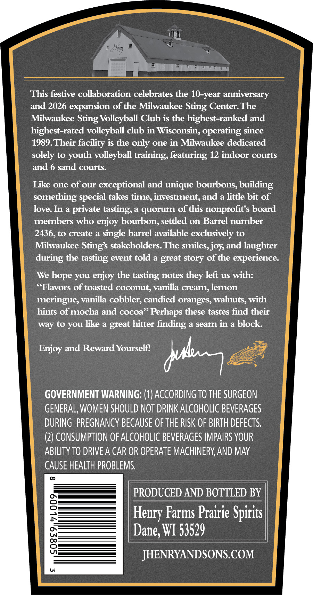
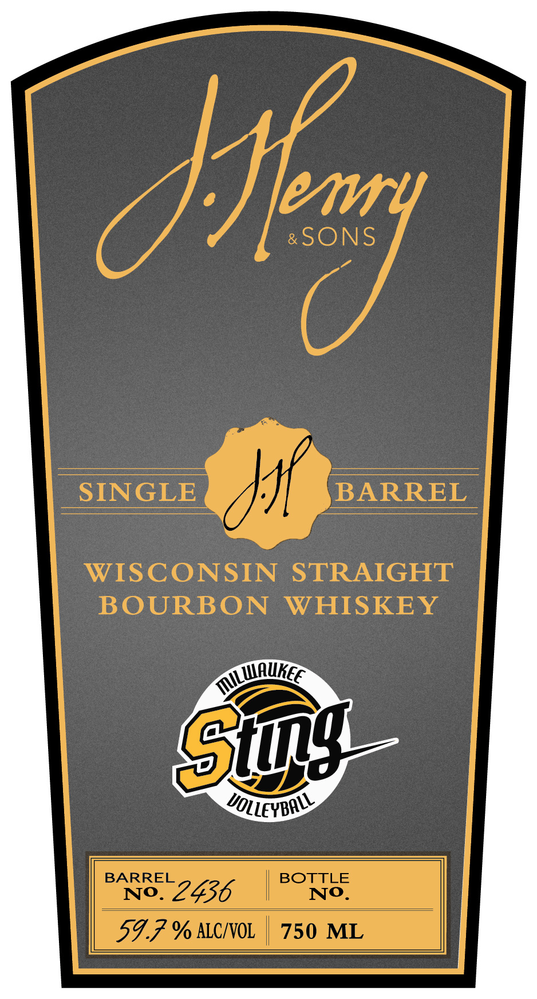

# TTB COLA Label Images - TTBID 26086001000117

**Brand Name:** J. HENRY & SONS

**Issue Date:** 03/30/2026

**Origin Code:** 48

**Product Class/Type:** 101

**Source:** [TTB Public COLA Registry](https://ttbonline.gov/colasonline/viewColaDetails.do?action=publicFormDisplay&ttbid=26086001000117)

## Label Images

### Back Label

### Front Label

### Label 3

## Extracted Label Text

*Text extracted via OCR - may contain errors*

*1 image(s) excluded: text did not meet readability threshold*

**Detected Proof:** 119.4

### Back Label

This festive collaboration celebrates the 10-year anniversary
and 2026 expansion of the Milwaukee Sting Center The
Milwaukee Sting Volleyball Club is the highest-ranked and
highest-rated volleyball club in Wisconsin, operating since
1989.Their facility is the only one in Milwaukee dedicated
solely to youth volleyball training, featuring 12 indoor courts
and 6 sand courts.
Like one of our
exceptional and unique bourbons, building
something
takes time, investment, and a little bit of
love. In a
private
a quorum of this nonprofit's board
merbers who enjoy bourbon, settled on Barrel number
2436,to create a single barrel available exclusively to
Milwaukee Stings stakeholders The smiles,joy and laughter
during the tasting event told a great
of the
experience:
We hope you enjoy the tasting notes
left us with:
{Flavors of toasted coconut, vanilla cream, lemon
meringue, vanilla cobbler; candied oranges; walnuts, with
hints of mocha and cocoa" Perhaps these tastes find their
to you like a great hitter
finding
a seam in a block
Enjoy and Reward Yourself?
GOVERNMENT WARNING: (1) ACCORDING TO THE SURGEON
GENERAL, WOMEN SHOULD NOT DRINK ALCOHOLIC BEVERAGES
DURING  PREGNANCY BECAUSE OF THE RISK OF BIRTH DEFECTS:
(2) CONSUMPTION OF ALCOHOLIC BEVERAGES IMPAIRS VOUR
ABILITY TO DRIVEA CAR OR OPERATE MACHINERY,AND May
CAUSE HEALTH PROBLEMS.
PRODUCED AND BOTTLED BY
8
Farms Prairie Spirits |
Dane, WI 53529
8
JHENRYANDSONS.COM
special
tasting,
story
they
way
db
Henry

### Front Label

/1
Ip
SINGLE
BARREL
WISCONSIN
STRAIGHT
BOURBON
WHISKEY
Gtg
VOLLeYBall
BARREL
BOTTLE
No.
2436
No.
59.7 % ALCIVOL
750 ML
Milwaukec
