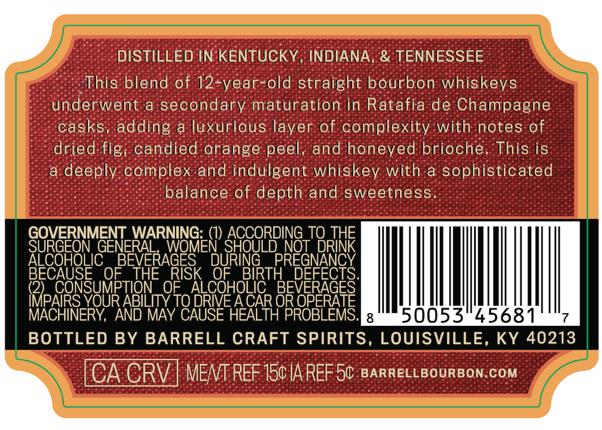
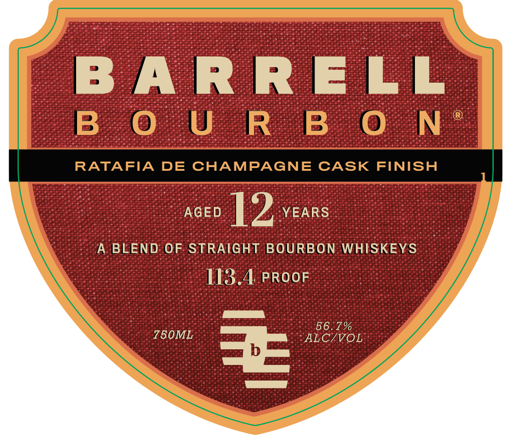

# TTB COLA Label Images - TTBID 26086001000139

**Brand Name:** BARRELL BOURBON

**Issue Date:** 04/02/2026

**Origin Code:** 22

**Product Class/Type:** 121

**Source:** [TTB Public COLA Registry](https://ttbonline.gov/colasonline/viewColaDetails.do?action=publicFormDisplay&ttbid=26086001000139)

## Label Images

### Back Label

### Front Label

### Label 2

## Extracted Label Text

*Text extracted via OCR - may contain errors*

*1 image(s) excluded: text did not meet readability threshold*

**Detected Proof:** 113.4
**Detected Age:** 12 Years

### Back Label

DISTILLED IN KENTUCKY
INDIANA, & TENNESSEE
This blend of 12-year-old straight bourbon whiskeys
underwent a secondary maturation in Ratafia de Champagne
casks, adding a luxurious layer of complexity with notes of
dried fig; candied orange peel;
and honeyed brioche.
This is
a
deeply complex and indulgent whiskey with & sophisticated
balance of depth and sweetness
GOVERNMENT_WARNING:
ACCORDING_TQ THE
SURGEON GENERAL
WOMEN SHOULD NOT DRINK
ALCOHOLIC
BEVERAGES'
DURING
PREGNANCY
BECAUSE
OF
THE
RISK
OF
BIRTH
(2)
CONSUMPTION
OE
ALCOHOLIC
BEDEFEGES |
IMPAIRS YOUR ABILITY TO DRIVE ACAR OR OPERATE
MACHINERY; AND MAY CAUSE HEALTH PROBLEMS:
8
50053"45681
BOTTLED BY BARRELL CRAFT SPIRITS, LOUISVILLE, KY 40213
CA CRV
MENT REF 150 IA REF 50 BARRELLBOURBON COM

### Front Label

B A RRELL
B  0 U R B 0 N
RATAFIA
DE
CHAMPAGNE
CASK
FINISH
AGED
12
YEARS
A
BLEND OF STRAIGHT BOURBON WHISKEYS
113.4 PROOF
56.7%
750ML
ALC/VOL
EE
