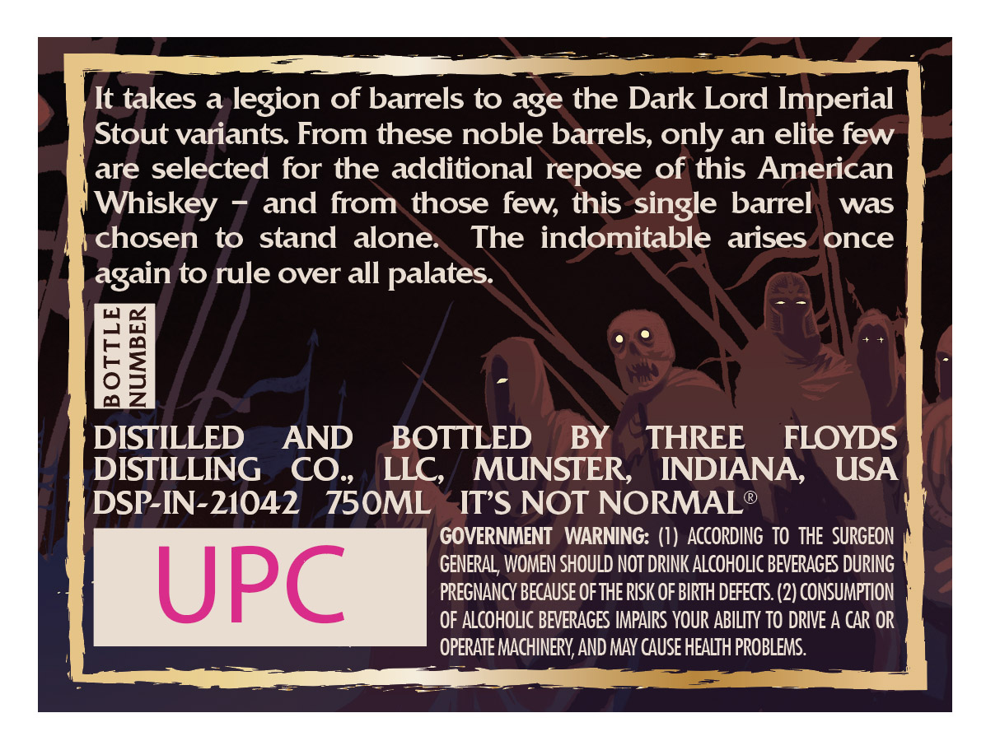
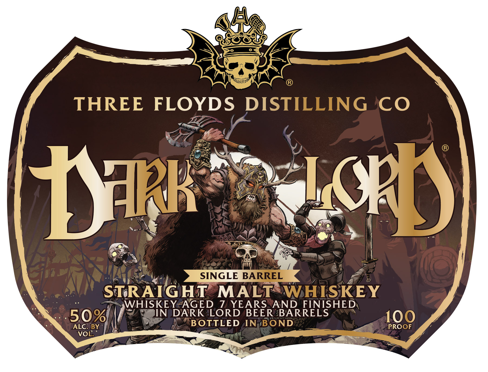

# TTB COLA Label Images - TTBID 26086001000340

**Brand Name:** DARK LORD SINGLE BARREL

**Issue Date:** 03/30/2026

**Origin Code:** 19

**Product Class/Type:** 117

**Source:** [TTB Public COLA Registry](https://ttbonline.gov/colasonline/viewColaDetails.do?action=publicFormDisplay&ttbid=26086001000340)

## Label Images

### Back Label

### Front Label

## Extracted Label Text

*Text extracted via OCR - may contain errors*

**Detected Age:** 7 Years

### Back Label

It takes a legion of barrels to age the Dark Lord Imperial
Stout variants. From these noble barrels, only an elite few
are selected for the additional repose of this American
Whiskey
and from those few this single barrel
was
chosen
to stand
alone:
The indomitable
arises
once
again to rule over all palates:
8
DISTILLED
AND
BOTTLED
BY
THREE
FLOYDS
DISTILLING
CO.
LLC,
MUNSTER,
INDIANA,
USA
DSP-IN-21042
750ML
ITS NOT NORMAL
GOVERNMENT   WARNING: (I) ACCORdINg  TO thE   SURGEON
GENERAL, WOMEN SHOULD NOT DRINK ALCOHOLIC BEVERAGES DURING
UPC
PREGNANCY BECAusE ofthE RISK OF BIRTH DeFECTS (2) CONSUMPTION
OF ALcoHoLc BEVERAGES IMPAIRS YOUR ABILITY TO DRIVE A CAR OR
OPERATE MACHINERY AND MAY cause HEALTH PROBLEMS.

### Front Label

THREE
FLOYDS
DISTILLING CO
In)
SINGLE BARREL
STRAIGHT
MALT
WHISKEY
WHISKEY AGED 7 YEARS
AND FINISHED
509
JN
DARK LORD
BEER BARRELS
100
ALC: BY
BOTTLED
IN
BOND
PROOF
VOL
1K
