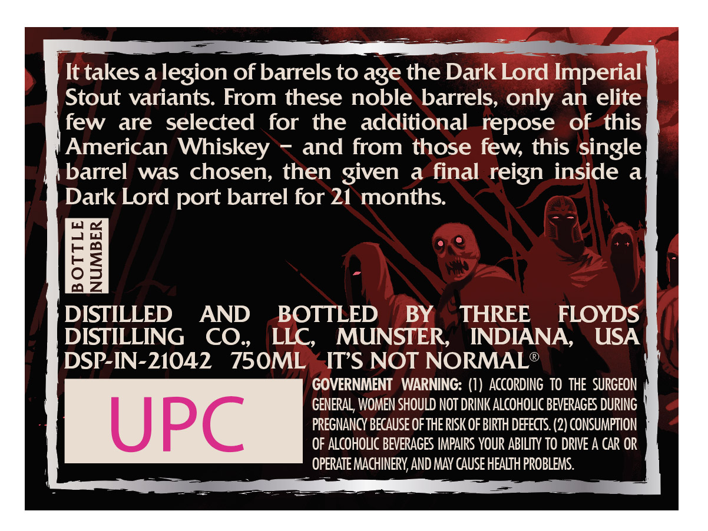
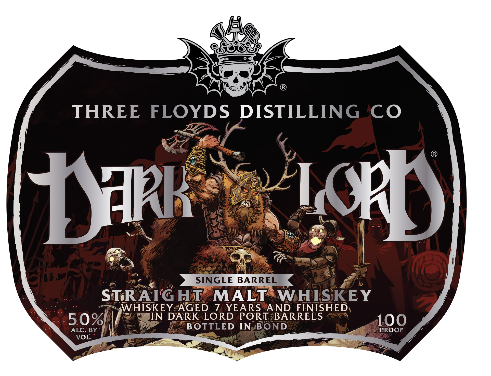

# TTB COLA Label Images - TTBID 26086001000343

**Brand Name:** DARK LORD SINGLE BARREL

**Issue Date:** 03/30/2026

**Origin Code:** 19

**Product Class/Type:** 117

**Source:** [TTB Public COLA Registry](https://ttbonline.gov/colasonline/viewColaDetails.do?action=publicFormDisplay&ttbid=26086001000343)

## Label Images

### Back Label

### Front Label

## Extracted Label Text

*Text extracted via OCR - may contain errors*

**Detected Proof:** 100
**Detected Age:** 7 Years

### Back Label

It takes a legion of barrels to age the Dark Lord Imperial
Stout variants. From these noble barrels, only an elite
few
are  selected
for the
additional   repose
of this
American Whiskey
and from those few, this single
barrel
was chosen, then given
a final reign inside
a
Dark Lord port barrel for 21 months
I
DISTILLED
AND
BOTTLED
BY
THREE
FLOYDS
DISTILLING
CO_
LLC,
MUNSTER
INDIANA
USA
DSP-IN-21042
750ML
ITS NOT NORMAL?
GOVERNMENT   WARNING: (1) ACCORdINg  TO thE   SURGEON
GENERAL;, WOMEN SHOULD NOT DRINK ALcoHOLIC BEVERAGES DURING
UPC
PREGNANCY Because ofTHE RISK OF BIRTH DEfECTS. (2) CONSUMPTION
OF ALCOHOLIC BEVERAGES IMPAIRS YOUR ABILITY TO DRIVE A CAR OR
OPERATE MACHINERYAND MAY cause HEALTH PROBLEMS.

### Front Label

THREE
FLOYDS
DISTILLING CO
KD
SINGLE
BARREL
STRATGHT
MALT
WHISKEY
WHISKEY AGED
7 YEARS AND
FINISHED
50%
JN
DARK LORD
PORT BARRELS
100
ALC: BY
BOTTLED
IN
BOND
PROOF
VOL:
KkK
