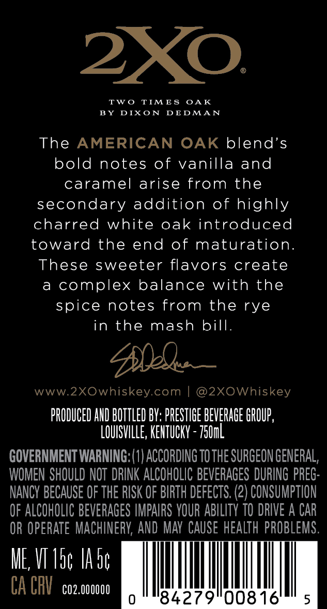
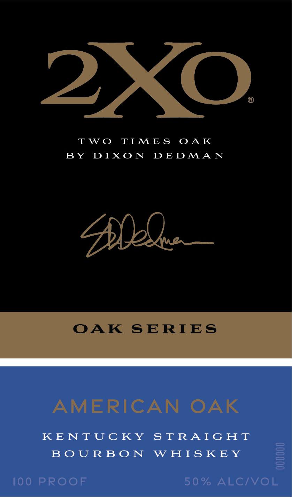
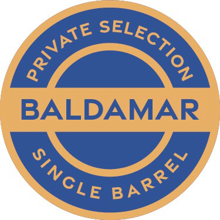

# TTB COLA Label Images - TTBID 26086001000346

**Brand Name:** 2XO

**Issue Date:** 03/27/2026

**Origin Code:** 39

**Product Class/Type:** 101

**Source:** [TTB Public COLA Registry](https://ttbonline.gov/colasonline/viewColaDetails.do?action=publicFormDisplay&ttbid=26086001000346)

## Label Images

### Back Label

### Label 1

### Label 3

## Extracted Label Text

*Text extracted via OCR - may contain errors*

**Detected Proof:** 100

### Back Label

2XO.

TWO TIMES OAK
BY DIXON DEDMAN

The AMERICAN OAK blend’s
bold notes of vanilla and
caramel arise from the
secondary addition of highly
charred white oak introduced
toward the end of maturation.
These sweeter flavors create
a complex balance with the
spice notes from the rye
in the mash bill.

Abie —

www.2XOwhiskey.com | @2XOWhiskey

PRODUCED AND BOTTLED BY: PRESTIGE BEVERAGE GROUP,
LOUISVILLE, KENTUCKY - 750m
GOVERNMENT WARNING: (1) ACCORDING T0 THE SURGEON GENERAL,
WOMEN SHOULD NOT DRINK ALCOHOLIC BEVERAGES DURING PREG-
NANCY BECAUSE OF THE RISK OF BIRTH DEFECTS. (2) CONSUMPTION
OF ALCOHOLIC BEVERAGES IMPAIRS YOUR ABILITY TO DRIVE A CAR
OR OPERATE MACHINERY, AND MAY CAUSE HEALTH PROBLEMS.

Me ET

00816" 5

0° 84279

### Label 1

2XO

TWO TIMES OAK

BY DIXON DEDMAN

Dhl

OAK SERIES

AMERICAN OAK

KENTUCKY STRAIGHT

BOURBON WHISKEY

100 PROOF

50% ALC/VOL

### Label 3

BALDAMAR
SeLEcTion
PRIVATE
SinGle
BARREL
