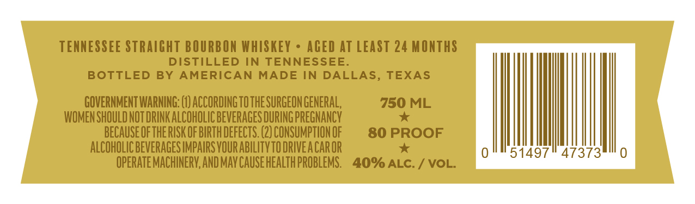

# TTB COLA Label Images - TTBID 26086001000351

**Brand Name:** AMERICAN MADE

**Issue Date:** 04/02/2026

**Origin Code:** 44

**Product Class/Type:** 101

**Source:** [TTB Public COLA Registry](https://ttbonline.gov/colasonline/viewColaDetails.do?action=publicFormDisplay&ttbid=26086001000351)

## Label Images

### Label 1

## Extracted Label Text

*Text extracted via OCR - may contain errors*

**Detected Proof:** 80

### Label 1

TENNESSEE STRAIGHT BOURBON WHISKEY
ACED AT LEAST 24 MONTHS
DISTILLED IN TENNESSEE_
BOTTLED
BY
AMERICAN
MADE IN DALLAS, TEXAS
GOVERNMENT WARNING;
ACCORDING TOTHE SURGEON GENERAL,
750 ML
WOMEN SHOULD NOT DRINK ALCOHOLIC BEVERAGES DURING PREGNANCY
BECAUSE OFTHE RISK OF BIRTH DEFECTS. (2) CONSUMPTION OF
80 PROOF
ALCOHOLIC BEVERAGES IMPAIRS VOUR ABILITVTO DRIVEA CAROR
51497
47373
OPERATE MACHINERV,AND MAV Cause HEALTh PROBLEMS.
40% ALC:
VOL:
