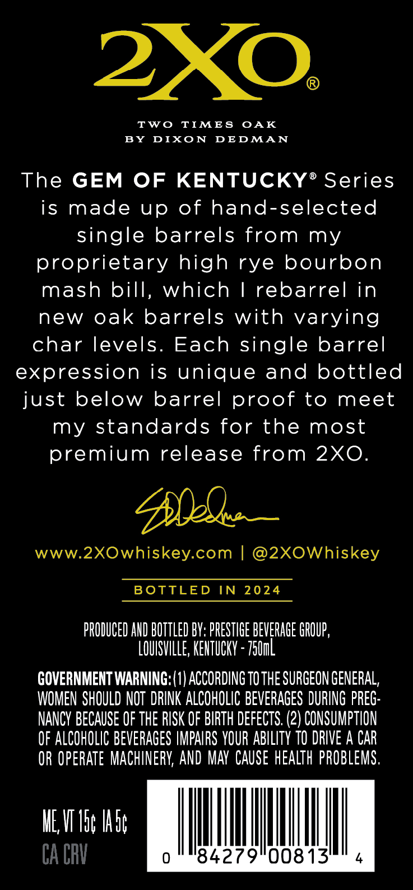
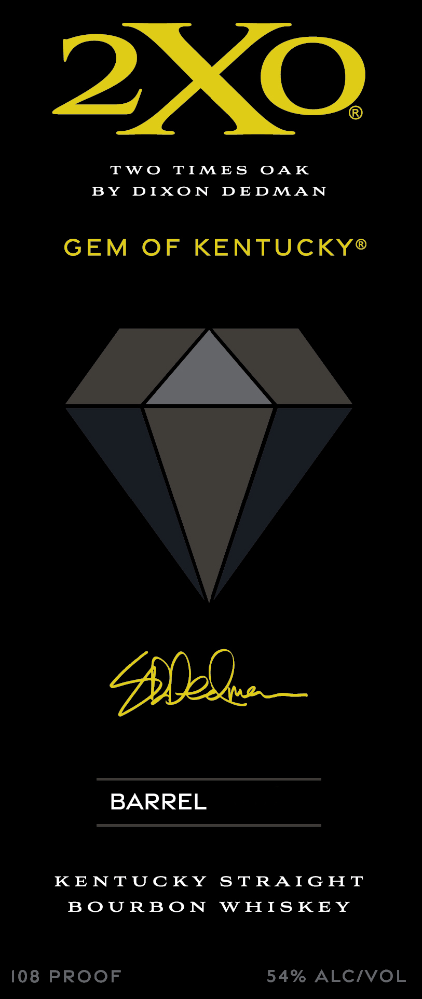
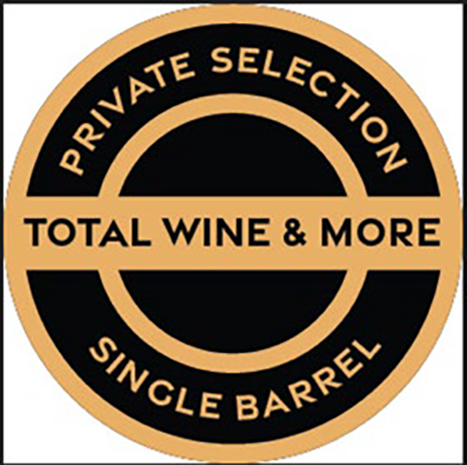

# TTB COLA Label Images - TTBID 26086001000353

**Brand Name:** 2XO

**Issue Date:** 03/27/2026

**Origin Code:** 39

**Product Class/Type:** 101

**Source:** [TTB Public COLA Registry](https://ttbonline.gov/colasonline/viewColaDetails.do?action=publicFormDisplay&ttbid=26086001000353)

## Label Images

### Back Label

### Label 1

### Label 3

### Label 4

## Extracted Label Text

*Text extracted via OCR - may contain errors*

*1 image(s) excluded: text did not meet readability threshold*

**Detected Proof:** 108

### Back Label

2XO
Two
TIMES
OAK
BY
DIXO N
DEDMAN
The GEM
OF KENTUCKY
Series
is made
up
of hand-selected
single barrels from my
proprietary high rye bourbon
mash bill, which
1
rebarrel in
new oak barrels with varying
char levels_
Each single barrel
expression is unique and bottled
just below barrel proof to
meet
my standards for the most
premium release from 2X0.
Me
www.2XOwhiskey.com
@2XOWhiskey
BOTTLED
IN
2024
PRODUCED AND BOTTLED BV: PRESTIGE BEVERAGE GROUP ,
LOUISVILLE; KEHTuCKY = Z5Uml
GOVERNMENT WARNING: (1) ACCORDING TO THE SURGEON GENERAL,
WOMEN SHOULD NOT  DRINK ALCOHOLIC BEVERAGES DURING PREG:
NANCY BECAUSE OF THE RISK OF BIRTH DEFECTS. (2) CONSUMPTION
OF ALCOHOLIC BEVERAGES IMPAIRS YOUR ABILITV TO DRIVE A CAR
OR Operate MACHINERV; AND MAY CAuSe hEalth PROBLEMS.
IE V I5c Ias;
CA CRV
0
'84279"00813'

### Label 1

TWO TIMES OAK
BY DIXON DEDMAN
GEM OF KENTUCKY®
BARREL
KENTUCKY STRAIGHT
BOURBON WHISKEY
108 PROOF 54% ALC/VOL

### Label 4

TOTAL WINE & MORE
GelEctioN
PRIVATE
SINCLE
BARREL
