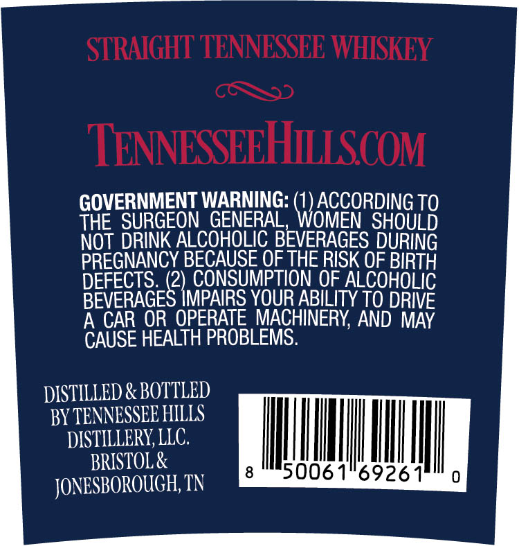
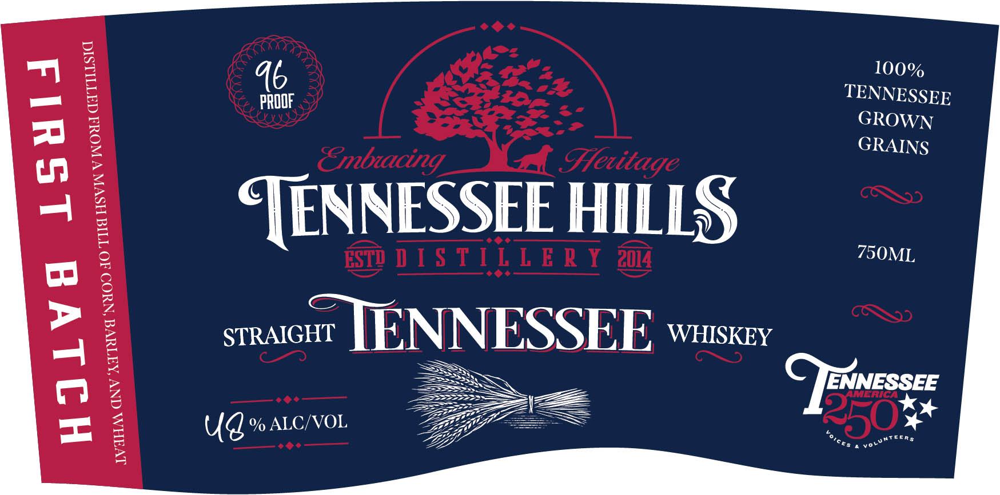

# TTB COLA Label Images - TTBID 26086001000493

**Brand Name:** TENNESSEE HILLS DISTILLERY

**Issue Date:** 03/30/2026

**Origin Code:** 43

**Product Class/Type:** 140

**Source:** [TTB Public COLA Registry](https://ttbonline.gov/colasonline/viewColaDetails.do?action=publicFormDisplay&ttbid=26086001000493)

## Label Images

### Back Label

### Front Label

## Extracted Label Text

*Text extracted via OCR - may contain errors*

### Back Label

STRAIGHT TENNESSEE WHISKEY
TENNESSEEHIISCOM
GOVERNMENT WARNING:
ACCORDING TO
THE SURGEON GENERAL
WOMEN SHOULD
NOT DRINK ALCOHOLIC BEVERAGES DURING
PREGNANCY BECAUSE OE THE RISK OF BIRTH
DEFECTS_(2) CONSUMPTION OF_ALCOHOLIC
BEVERAGES IMPAIRS YOUR ABILITY TO DRIVE
A CAR OR  OPERATE MACHINERY; AND MAY
CAUSE HEALTH PROBLEMS:
DISTILLED & BOTTLED
BY TENNESSEE HILLS
DISTILLERY, LIC.
BRISTOL &
5006
69261
JONESBOROUGHI; TN

### Front Label

100%

PROOF

TENNESSEE

GROWN

GRAINS

TENNESSEE HILLS

VAXOWOG

swvo TENNESSEE Waskey

ww

ENNESSEE

>

Ud % ALC/VOL

GP

——s

=
