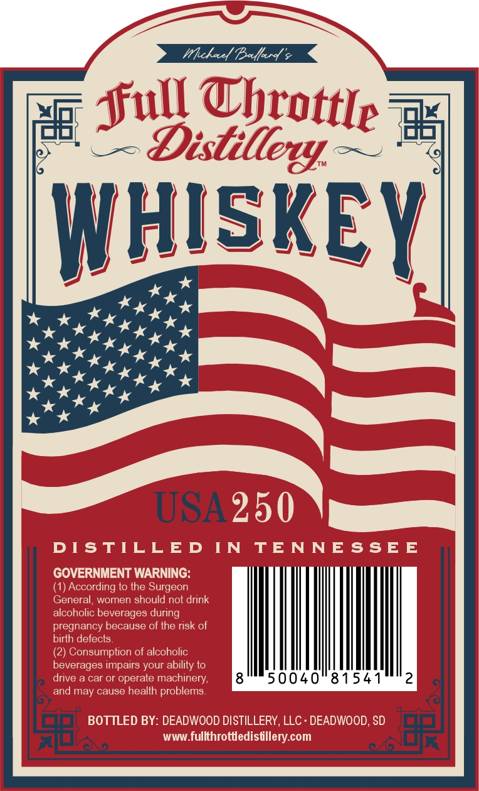
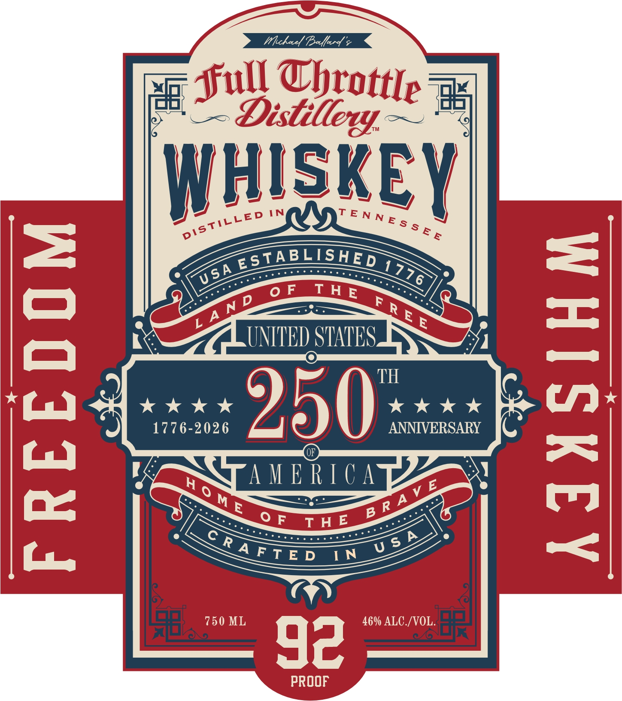

# TTB COLA Label Images - TTBID 26086001000520

**Brand Name:** FULL THROTTLE DISTILLERY

**Issue Date:** 03/30/2026

**Origin Code:** 42

**Product Class/Type:** 140

**Source:** [TTB Public COLA Registry](https://ttbonline.gov/colasonline/viewColaDetails.do?action=publicFormDisplay&ttbid=26086001000520)

## Label Images

### Back Label

### Front Label

### Label 3

## Extracted Label Text

*Text extracted via OCR - may contain errors*

*1 image(s) excluded: text did not meet readability threshold*

### Back Label

Whckxd Bsoyfd
Sud alegttle 77
WHISKEY
"
USA 250
F
DIsTILLED
IN
TENNESSEE
GOVERNMENT WARNING:
(1) According to Ihe Surgeon
General,
women
should not drink
alcoholic beverages during
pregnancy because of the risk of
birth defecls
(2) Consumption of alcoholic
beverages impairs your ability to
drive
car or operate machinery;
50040"81541
2
and may cause health problems
BOTTLED BY: DEADWOOD DISTILLERY, LLC  DEADWOOD, SD
WWW_
fullthrottledistllerycom

### Front Label

xin

ope

HISKE

STABLISHED

SS

Te SAL OLORS oe

se

SA nimi sis ANTES SS

kkk

kkk

1776-2026

2250

ANNIVERSARY C

: TUES

SLEUSEA reer sn envEekolenes®

a

Pa

sah

Lp
