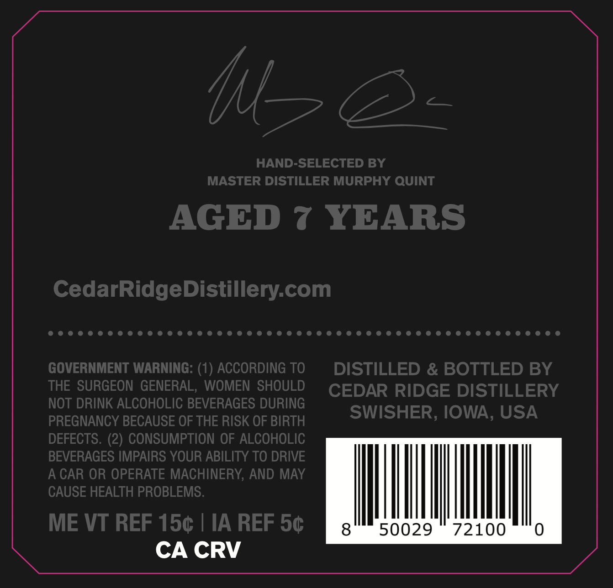
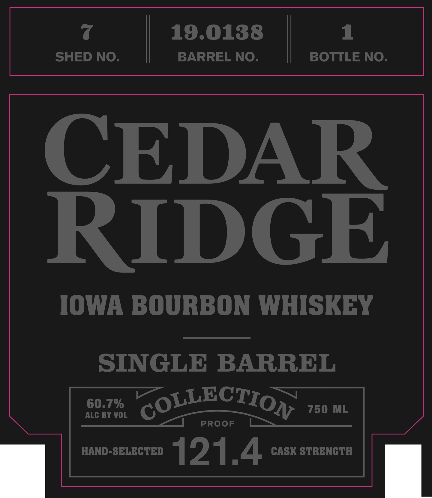

# TTB COLA Label Images - TTBID 26086001000568

**Brand Name:** CEDAR RIDGE

**Issue Date:** 03/30/2026

**Origin Code:** 20

**Product Class/Type:** 141

**Source:** [TTB Public COLA Registry](https://ttbonline.gov/colasonline/viewColaDetails.do?action=publicFormDisplay&ttbid=26086001000568)

## Label Images

### Back Label

### Front Label

## Extracted Label Text

*Text extracted via OCR - may contain errors*

**Detected Proof:** 121.4
**Detected Age:** 7 Years

### Back Label

HAND-SELECTED BY
MASTER DISTILLER MURPHY QUINT
AGED
7 YEARS
CedarRidgeDistillery-com
GOVERNMENT WARNING: (1_
ACCORDING TO
DISTILLED & BOTTLED BY
THE SURGEON GENERAL, WOMEN SHOULD
CEDAR RIDGE DISTILLERY
NOT DRINK ALCOHOLIC BEVERAGES DURING
SWISHER, IOWA, USA
PREGNANCY BECAUSE OF THE RISK OF BIRTH
DEFECTS. (2) CONSUMPTION OF ALCOHOLIC
BEVERAGES IMPAIRS YOUR ABILITY TO DRIVE
A CAR OR OPERATE MACHINERY, AND MAY
CAUSE HEALTH PROBLEMS.
ME VT REF 150
IA REF 5c
8
50029
72100
CA CRV

### Front Label

19.0138
1
SHED NO
BARREL NO
BOTTLE NO.
REDGE
IOWA BOURBON WHISKEY
SINGLE
BARREL
60.7%
COLLECTION
750 ML
ALC BY VOL
PROOF
HAND-SELECTED
121.4
CASK STRENGTH
