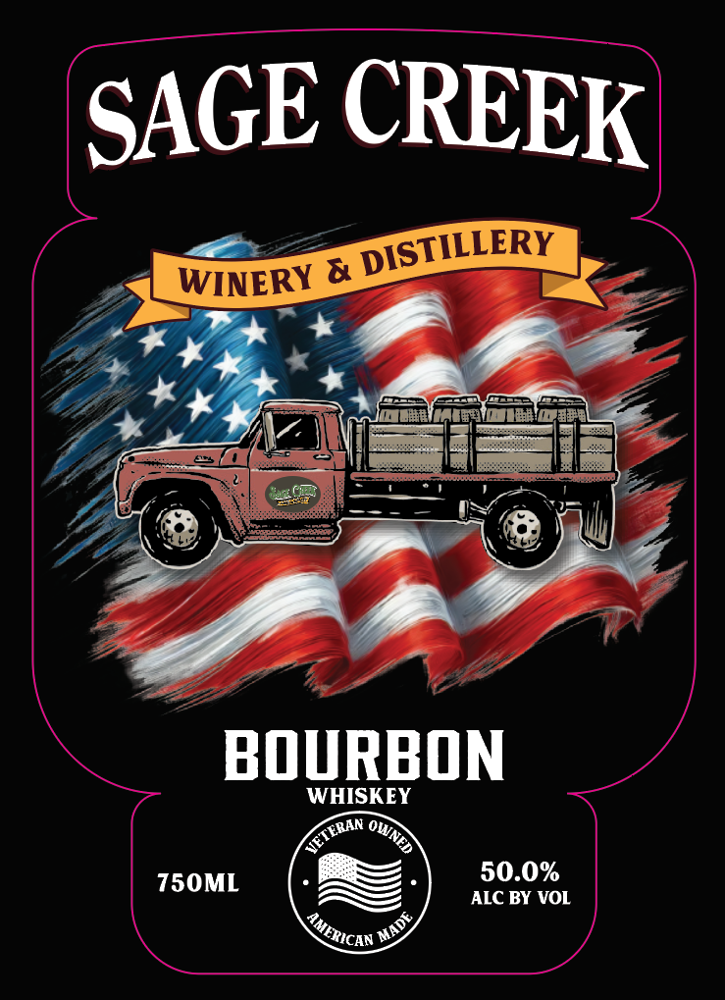
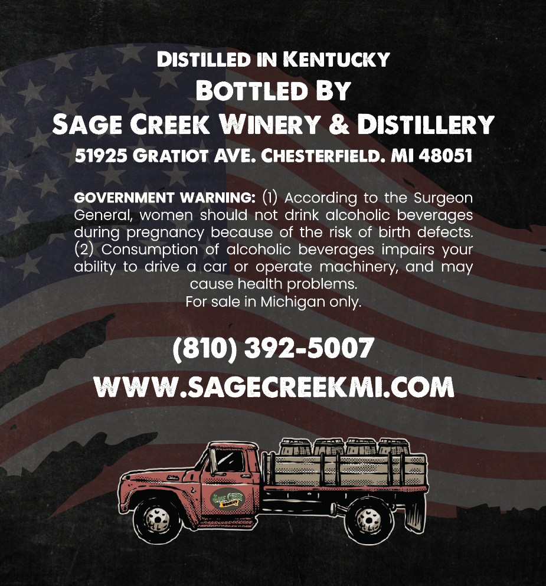

# TTB COLA Label Images - TTBID 26086001000626

**Brand Name:** SAGE CREEK WINERY & DISTILLERY

**Issue Date:** 05/04/2026

**Origin Code:** 06

**Product Class/Type:** 141

**Source:** [TTB Public COLA Registry](https://ttbonline.gov/colasonline/viewColaDetails.do?action=publicFormDisplay&ttbid=26086001000626)

## Label Images

### Label 1

### Label 2

## Extracted Label Text

*Text extracted via OCR - may contain errors*

**Detected Proof:** 100

### Label 1

CREEK
WINERY &
BOURBON
WHISKEY
750ML
50.0%
ALC BY VOL
SAGE
DISTILLERY
VETERAN _
OWND
AMERICAD
MADE

### Label 2

DISTILLED IN KENTUCKY
BOTTLED BY
SAGE CREEK WINERY & DISTILLERY
51925 GRATIOT AVE. CHESTERFIELD: MI 48051
GOVERNMENT WARNING: (1) According to the Surgeon
General; women should not drink alcoholic beverages
during pregnancy because of the risk of birth defects:
(2) Consumption of alcoholic beverages impairs your
ability to
drive
car
or
operate machinery; and
cause health problems
For sale in Michigan only:
(810) 392-5007
WWW SAGECREEKMILCOM
may
