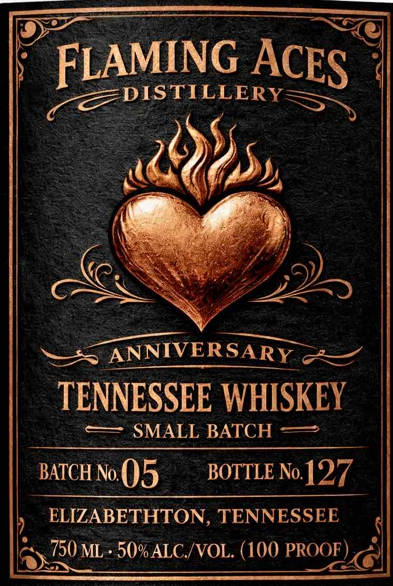
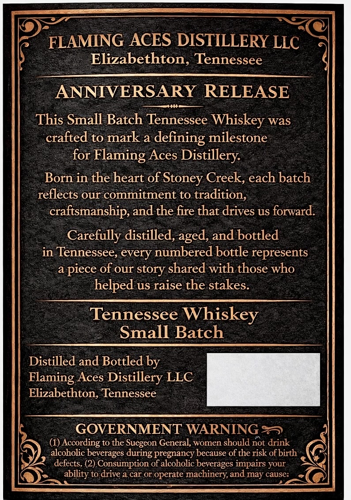

# TTB COLA Label Images - TTBID 26086001000642

**Brand Name:** FLAMING ACES DISTILLERY

**Fanciful Name:** TENNESSEE WHISKEY

**Issue Date:** 03/30/2026

**Origin Code:** 43

**Product Class/Type:** 140

**Source:** [TTB Public COLA Registry](https://ttbonline.gov/colasonline/viewColaDetails.do?action=publicFormDisplay&ttbid=26086001000642)

## Label Images

### Label 1

### Label 2

## Extracted Label Text

*Text extracted via OCR - may contain errors*

**Detected Proof:** 100

### Label 1

FLAMING
=DISTILLERY
ANNIVER SARY
TENNESSEE WHISKEY
SMALL BATCH
BATCH No
05
BOTTLE No.
127
ELIZABETHTON, TENNESSEE
750 ML
50% ALC /VOL. (100 PROOF
ACES

### Label 2

FLAMING ACES DISTILLERY LLC
Elizabethton, Tennessee
ANNIVERSARY RELEASE
This Small Batch Tennessee Whiskey was
crafted to mark a
defining milestone
for Flaming Aces Distillery:
Born in the heart of Stoney Creek, each batch
reflects our commitment to tradition,
craftsmanship, and the fire that drives us forward
Carefully distilled,
and bottled
in Tennessee, every numbered bottle represents
a piece of our story shared with those who
helped us raise the stakes.
Tennessee
Whiskey
Small Batch
Distilled and Bottled by
Elaming Aces Distillery LLC
Elizabethton, Tennessee
GOVERNMENT WARNING 2
(1) According to the Suegeon General;
women
should not drink
alcoholic beverages
pregnancy because of the risk of birth
defects, (2) Consumption of alcoholic beverages impairs your
ability to drive a car or operate machinery,and may cause:
aged,
during _
