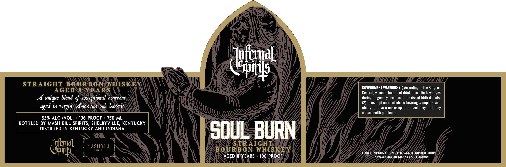
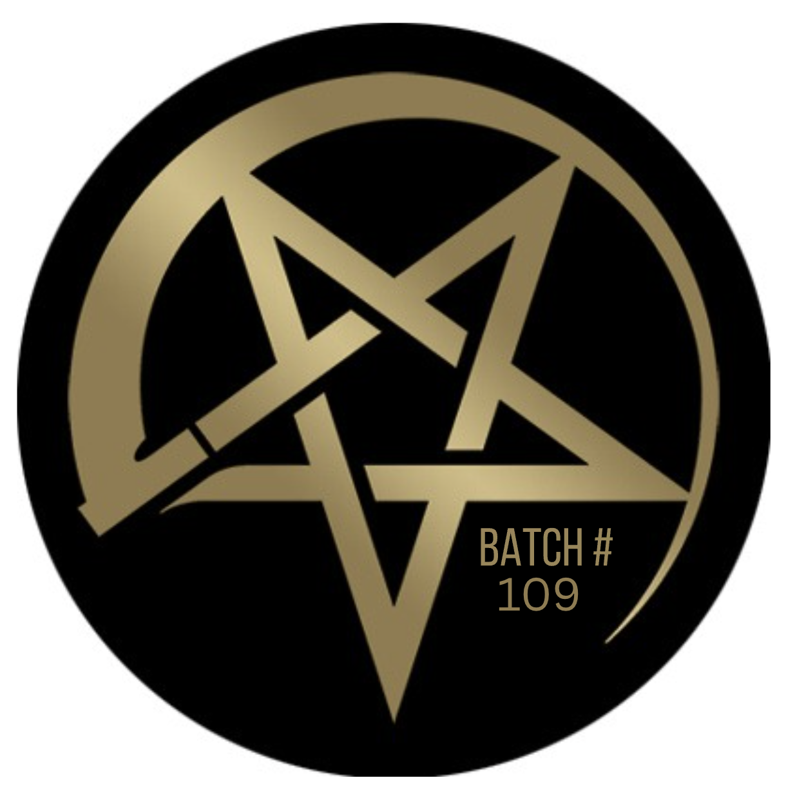

# TTB COLA Label Images - TTBID 26086001000679

**Brand Name:** INFERNAL SPIRITS

**Issue Date:** 04/01/2026

**Origin Code:** 22

**Product Class/Type:** 101

**Source:** [TTB Public COLA Registry](https://ttbonline.gov/colasonline/viewColaDetails.do?action=publicFormDisplay&ttbid=26086001000679)

## Label Images

### Label 1

### Label 2

## Extracted Label Text

*Text extracted via OCR - may contain errors*

*1 image(s) excluded: text did not meet readability threshold*

**Detected Proof:** 106
**Detected Age:** 8 Years

### Label 1

ITuleal
"WXNIAHL
STRAIGHT BOURBON
WHISKE
GOVERNMENT WARNING: (1) According to the Surgeon
AGED 8 YEARS
General, women should not drink alcoholic beverages
A unique blend of exceptional bourbons
pregnancy because of the risk of birth defects.
(2) Consumption of alcoholic beverages impairs your
in
virgin
American oak barrels
ability to drive a car or operate machinery;
may
cause health problems:
539 ALC./VOL.
106 PROOF
750 ML
BOTTLED BY MASH BILL SPIRITS, SHELBYVILLE, KENTUCKY
DISTILLED IN KENTUCKY AND INDIANA
SouL BURN
dfat
MASHBILL
BOUREON {GHIS KE
2026 INFERNAL SPIRITS
ALL RIGHTS RESERVED
AGED 8 YEARS
106 PROOF
WWW.DRINKINFERNALSPIRITS COM
during
gged
and
