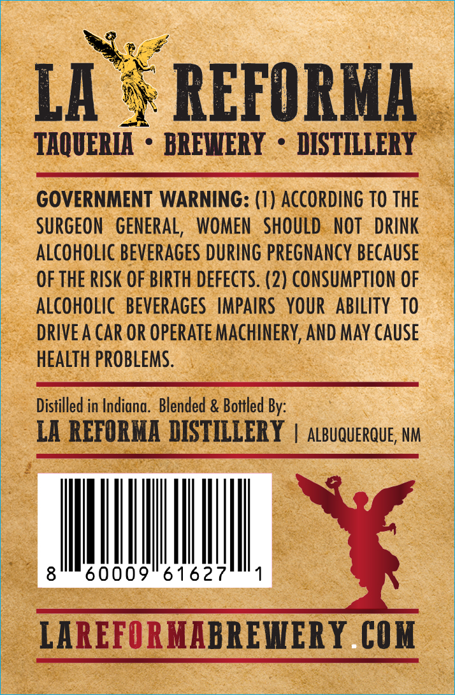
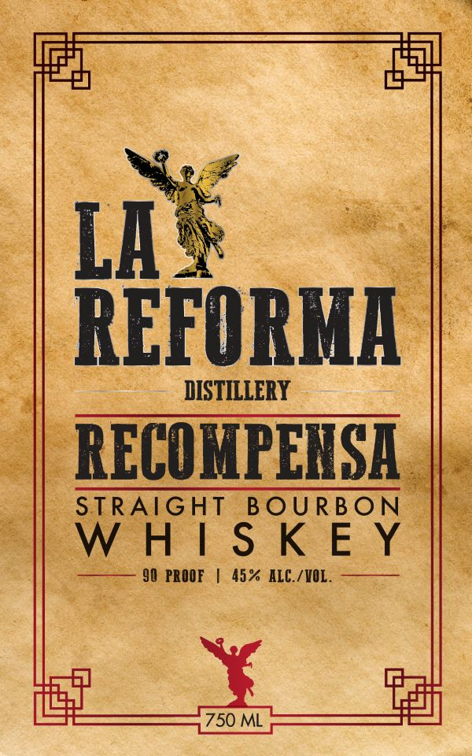

# TTB COLA Label Images - TTBID 26088001000066

**Brand Name:** LA REFORMA

**Fanciful Name:** RECOMPENSA

**Issue Date:** 03/30/2026

**Origin Code:** 34

**Product Class/Type:** 101

**Source:** [TTB Public COLA Registry](https://ttbonline.gov/colasonline/viewColaDetails.do?action=publicFormDisplay&ttbid=26088001000066)

## Label Images

### Back Label

### Front Label

## Extracted Label Text

*Text extracted via OCR - may contain errors*

**Detected Proof:** 90

### Back Label

LA
REFORMA
TAQUERLA
BREWERY
DISTILLERY
GOVERNMENT WARNING: (I ) ACCORDING TO THE
SURGEoN   GeNERAL,  WOMEN
SHOULD   NOT
DRINK
ALCOHOLIC BeVERAGeS DURING PREGNAncY BECAUSe
OF THE RISK OF BIRTH defects: (2) CONSUMPTION OF
ALCOHOLIC   beverAGeS   IMPAIrs  YOUR
ABILITY TO
DRIVE A CAR OR OPERATE MAchInERY; AND May CAUSe
hEALTh PROBLEMS .
Distilled in Indiana. Blended & Bottled By:
LA REFORMA DISTILLERY
ALBUQUERQUE; NM
8
60009" 61627
LAREFORMABREHERY COM

### Front Label

coe

4

gall

le

Si

LA &

/REFORMA

DISTILLERY

RECOMPENSA |

BOURBON

PHIS KEY

} PROOF | 45% ALC./WOL.

a

LE

fg
