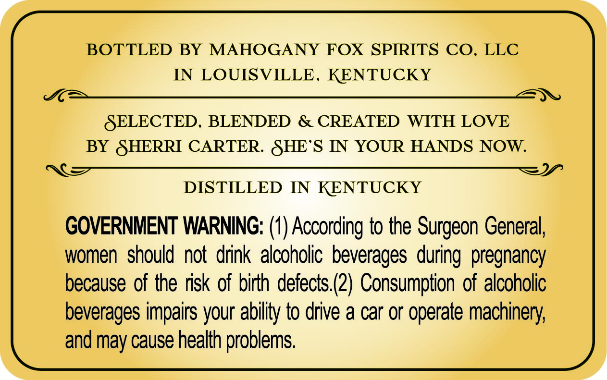
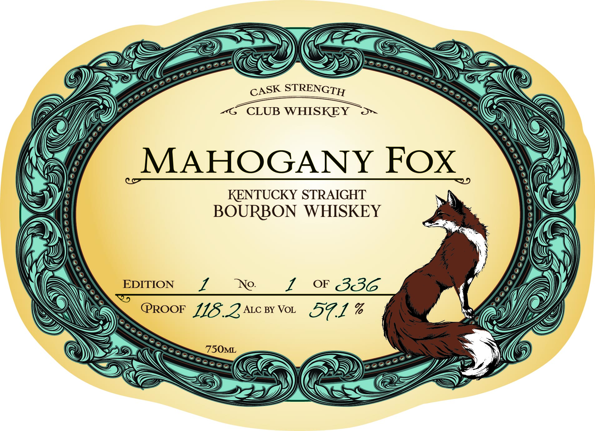
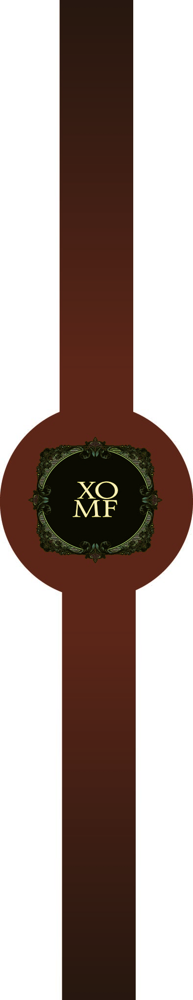

# TTB COLA Label Images - TTBID 26088001000082

**Brand Name:** MAHOGANY FOX

**Issue Date:** 03/30/2026

**Origin Code:** 22

**Product Class/Type:** 101

**Source:** [TTB Public COLA Registry](https://ttbonline.gov/colasonline/viewColaDetails.do?action=publicFormDisplay&ttbid=26088001000082)

## Label Images

### Back Label

### Label 1

### Label 3

### Label 4

## Extracted Label Text

*Text extracted via OCR - may contain errors*

*2 image(s) excluded: text did not meet readability threshold*

**Detected Proof:** 114.2

### Back Label

BOTTLED BY MAHOGANY FOX SPRRITS CO
LLC
IN LOUISVILLE , KENTUCKY
SELECTED_
BLENDED
& CREATED
WITH LOVE
BY SHERRI CARTER. SHE'S IN YOUR HANDS NOW.
DISTILLED IN KENTUCKY
GOVERNMENT WARNING:
According to the Surgeon General,
women should not drink alcoholic beverages
pregnancy
because of the risk of birth defects (2) Consumption of alcoholic
beverages impairs your ability to drive a car or operate machinery;
and may cause health problems:
during

### Label 1

STRENGTH
CLUB WHISKEY
MAHOGANY FOX
KENTUCKY STRAIGHT
BOURBON WHISKEY
EDITION
1   No
1
OF
336
PROOF 118.2ALC BY VoL
57.1 %
750ML
CASK
