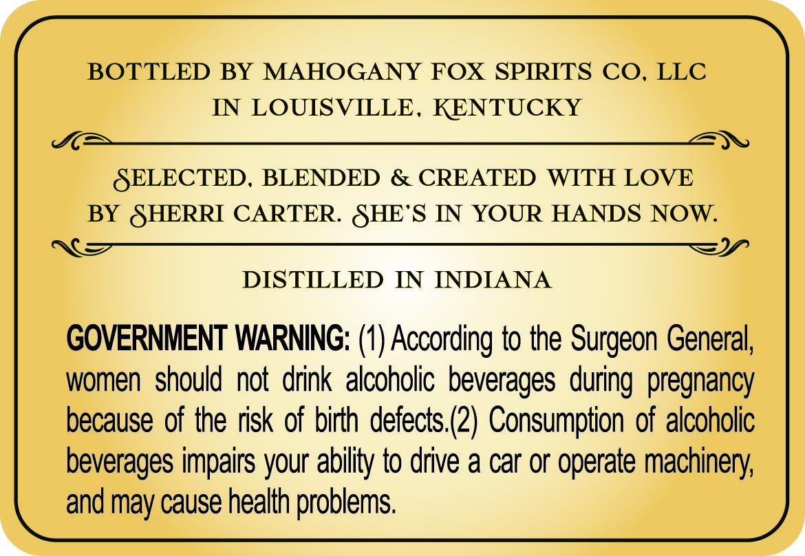
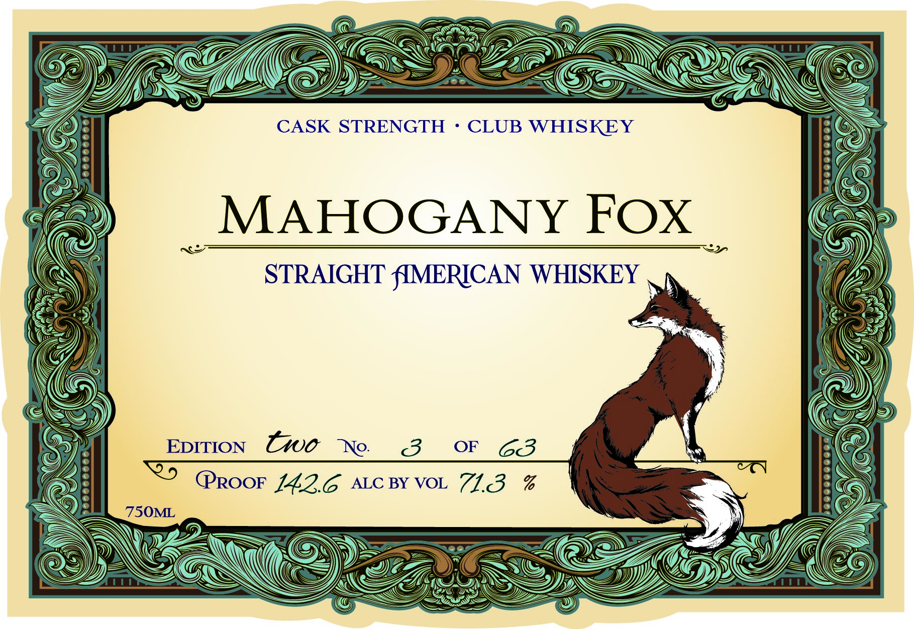

# TTB COLA Label Images - TTBID 26088001000088

**Brand Name:** MAHOGANY FOX

**Issue Date:** 03/30/2026

**Origin Code:** 22

**Product Class/Type:** 109

**Source:** [TTB Public COLA Registry](https://ttbonline.gov/colasonline/viewColaDetails.do?action=publicFormDisplay&ttbid=26088001000088)

## Label Images

### Back Label

### Label 1

### Label 3

### Label 4

## Extracted Label Text

*Text extracted via OCR - may contain errors*

*2 image(s) excluded: text did not meet readability threshold*

**Detected Proof:** 126

### Back Label

BOTTLED BY MAHOGANY FOX SPRRITS CO.
LLC
IN LOUISVILLE-
KENTUCKY
SELECTED,
BLENDED
& CREATED
WITH LOVE
BY SHERRI CARTER: SHE'S IN YOUR HANDS NOW.
DISTILLED IN INDIANA
GOVERNMENT WARNING: (1) According to the Surgeon General;,
women  should not drink alcoholic beverages
pregnancy
because of the risk of birth defects (2) Consumption of alcoholic
beverages impairs your
to drive a car or
machinery
and may cause health problems.
during
ability -
operate

### Label 1

CASK STRENGTH
CLUB WHISKEY

MAHOGANY FOX
STRAIGHT fIMERICAN WHISKEY
EDITION
two
3
OF
63
PROOF 142.6
ALC BY VOL
71.3
%
1
75OML
Ne:
