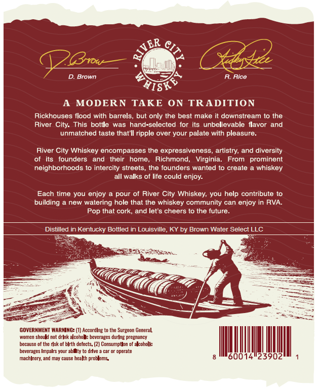
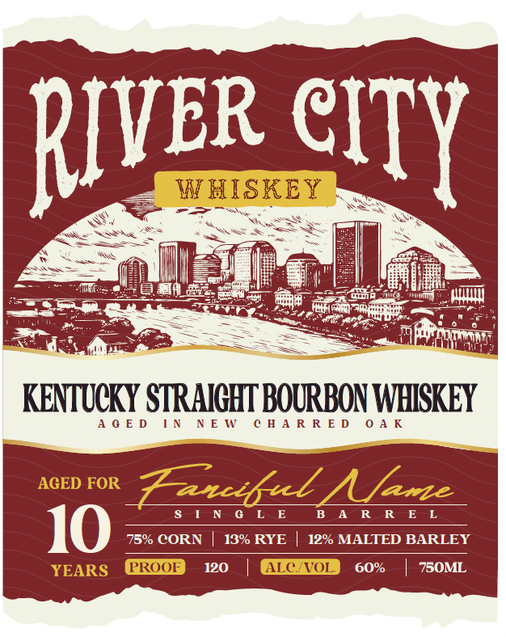

# TTB COLA Label Images - TTBID 26088001000090

**Brand Name:** RIVER CITY WHISKEY

**Issue Date:** 03/30/2026

**Origin Code:** 22

**Product Class/Type:** 101

**Source:** [TTB Public COLA Registry](https://ttbonline.gov/colasonline/viewColaDetails.do?action=publicFormDisplay&ttbid=26088001000090)

## Label Images

### Back Label

### Label 1

## Extracted Label Text

*Text extracted via OCR - may contain errors*

### Back Label

ER Cz
(3vw
D. Brown
Rice
HISK
MODERN
TAKE ON
TRADITION
Rickhouses flood with barrels
but only the best make it downstream t0 the
River City. This botile
was hand-selected for its unbelievable ilavor
and
unmatched taste that Il ripple over your palate with pleasure
River
Whiskey encompasses the expressiveness
artistry; and diversity
its   founders
and
their
home_
Richmond,
Virginia_
From
prominent
neighborhoods t0 intercity streets_
the founders wanted 0 create
whiskey
all walks of life could enjoy-
Each time you enjoy
pour of River City Whiskey; you help contribute to
building
new watering hole that the whiskey community can enjoy in RVA_
Pop that cork; and let'$ cheers t0 the future_
Distilled in Kentucky Bottled in Louisville, KY by Brown Water Select LLC
GOVERNMENT WARNING: (1) Accordlng "
the Surgeon General
Momcm
should not drInk alcohol
beverages Quring pregnancy
decause
of the rsk of blrth defects. (2] Consumptin _
Icoholkc
beverages Impalrs Your
drve =
operate
machlncry; and may cause health problems
3
City

### Label 1

oe cry

KENTUCKY STRAIGHT BOURBON WHISKEY

AGED IN NEW CHARRED OAK

SINGLE BARREL
75% CORN | 18% RYE | 12% MALTED BARLEY
0 | 60% | 750ML
