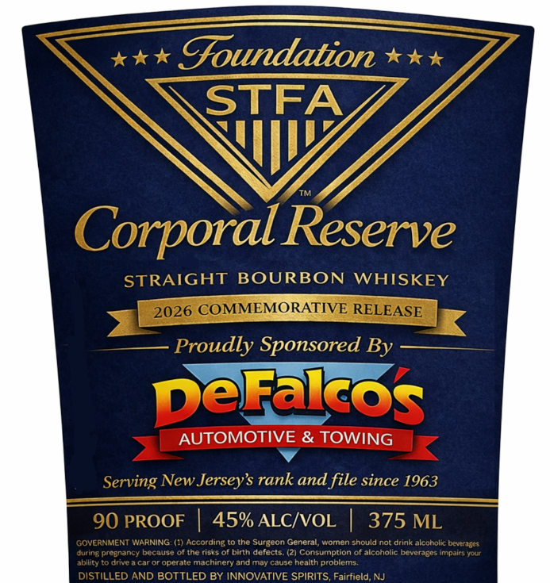

# TTB COLA Label Images - TTBID 26089001000023

**Brand Name:** FOUNDATION

**Fanciful Name:** CORPORAL RESERVE

**Issue Date:** 03/30/2026

**Origin Code:** 03

**Product Class/Type:** 101

**Source:** [TTB Public COLA Registry](https://ttbonline.gov/colasonline/viewColaDetails.do?action=publicFormDisplay&ttbid=26089001000023)

## Label Images

### Label 1

## Extracted Label Text

*Text extracted via OCR - may contain errors*

**Detected Proof:** 90

### Label 1

Goundation
STFA
I
Corporal Reserve
STRAIGHT
BOURBON
WHISKEY
2026 COMMEMORATIVE RELEASE
Proudly Sponsored By
DeFalos
AUTOMOTIVE & TOWING
Serving New Jerseys rank and file since 1963
90 PROOF
45% ALCIVOL
375 ML
GOVERNMENT WARNING (1) According
Surgcon General, women should not drink alcoholic beverages
during pregnancy because
Ahe risks
birth delects
Consumption
aicoholic bcverages impaits Yol
abllity
Dnvea Car
operate machinery andmay Cause
health problems
DISTILLED AND BOTTLED BY INNOVATIVE SPIRITS, Fairfield; NJ
