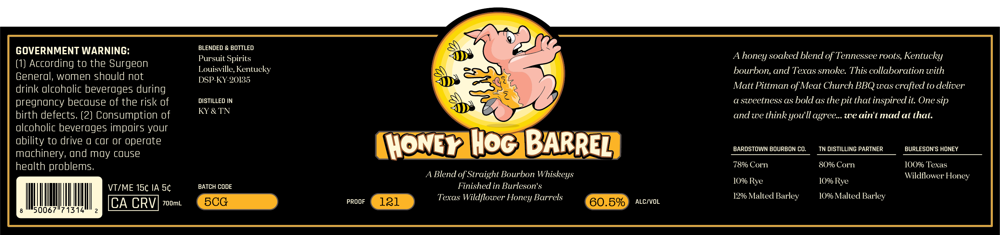
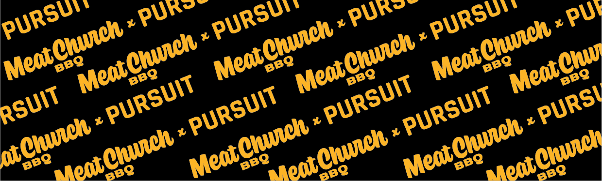

# TTB COLA Label Images - TTBID 26089001000031

**Brand Name:** PURSUIT

**Fanciful Name:** HONEY HOG BARREL

**Issue Date:** 03/30/2026

**Origin Code:** 22

**Product Class/Type:** 121

**Source:** [TTB Public COLA Registry](https://ttbonline.gov/colasonline/viewColaDetails.do?action=publicFormDisplay&ttbid=26089001000031)

## Label Images

### Label 1

### Label 2

## Extracted Label Text

*Text extracted via OCR - may contain errors*

**Detected Proof:** 121

### Label 1

GOVERNMENT WARNING:
BLENDED & BOTTLED
Pursuit Spirits
A
soaked blend of Tennessee roots, Kentucky
(1) According to the Surgeon
Louisville, Kentucky
bourbon, and Texas smoke. This collaboration with
General; women should not
DSP-KY- 20135
drink alcoholic beverages during
Matt Pittman of Meat Church BBQ was erafted to deliver
pregnancy because 0f the risk of
DISTILLED IN
a sweetness as bold as the pit that inspired it: One sip
birth defects. (2) Consumption of
KY & TN
andwe thinkyoull agree_.we aint mad at that:
alcoholic beverages impairs your
ability to drive 0 car or operate
MONGY IHOc BBARREZ
BARDSTOWN BOURBON CO.
TN DISTILLING PARTNER
BURLESON'S HONEY
machinery, und may cuuse
health problems;
78% Corn
80% Corn
IOO% Texas
Blend of Straight Bourbon Whiskeys
Wildflower
10% Rye
1O% Rye
VTIME 15c IA 5c
BATCH CODE
Finished in Burleson's
Texas Wildflower Honey Barrels
12% Malted Barley
10% Malted Barley
CA CRV
7ooml
5CG
PROOF
121
60.5%
ALC/VOL
50067/71314
honey
Honey

### Label 2

PURSUI ,
PURS-
PURSUI ,
PURS
PURSUI ,
PUV
[Cquch
MeotCunch
Cquch
MeatChech
MeatChuch
MeatChuw}
Meat(
Meat(
BBQ
BbQ
BBQ
PURSUIT
PURSUIT
PURSV
Rsuit
PURSUIT
PURSUIT
atCrch =
MeotChnch
MeatChuch
MeatCtch
Clch
Chuech
BBQ
Meatl
Meatl
BBQ
