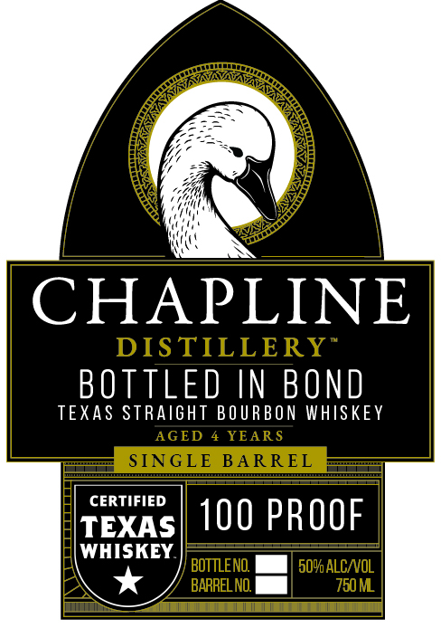
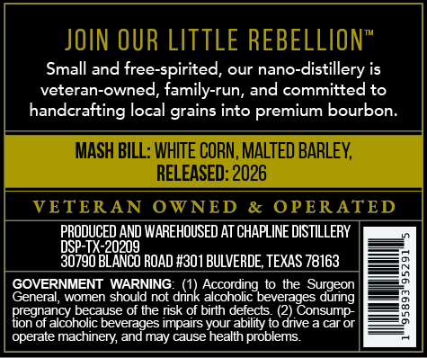

# TTB COLA Label Images - TTBID 26089001000135

**Brand Name:** BOTTLED IN BOND
TEXAS STRAIGHT BOURBON WHISKEY

**Issue Date:** 04/02/2026

**Origin Code:** 44

**Product Class/Type:** 111

**Source:** [TTB Public COLA Registry](https://ttbonline.gov/colasonline/viewColaDetails.do?action=publicFormDisplay&ttbid=26089001000135)

## Label Images

### Label 1

### Label 2

## Extracted Label Text

*Text extracted via OCR - may contain errors*

### Label 1

DIS TILLERY
AGED
YEAR S
SINGLE BARREL
BOTTENO
509alCNOL
BARREL NO
750M

### Label 2

Small and free-spirited, our nano-distillery is
veteran-owned, family-run, and committed to
handcrafting local grains into premium bourbon.

PRODUCED AND WAREHOUSED AT CHAPLINE DISTILLERY

30790 BLANCO ROAD #301 BULVERDE, TEXAS 78163

GOVERNMENT WARNING: (1) According to the Surgeon
General, women should not drink alcoholic beverages during
pregnancy because of the risk of bith defects, 2) Consump-

ion of alcoholic beverages impairs your ability to drive a car or
operate machinery, and may cause health problems
