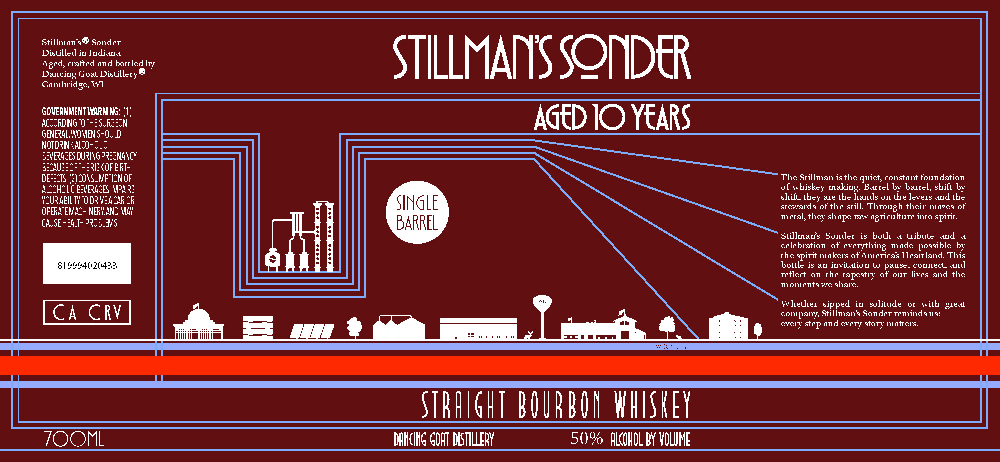

# TTB COLA Label Images - TTBID 26089001000215

**Brand Name:** STILLMAN'S SONDER

**Fanciful Name:** STRAIGHT BOURBON SINGLE BARREL

**Issue Date:** 03/30/2026

**Origin Code:** 48

**Product Class/Type:** 101

**Source:** [TTB Public COLA Registry](https://ttbonline.gov/colasonline/viewColaDetails.do?action=publicFormDisplay&ttbid=26089001000215)

## Label Images

### Label 1

## Extracted Label Text

*Text extracted via OCR - may contain errors*

### Label 1

Stillmans@ Sonder
Distdled itea did bottled by
STILLMAIIS SQIVIDER
Dancing Goat Distillery $
Cambridge, WI
GOVERNMENTWARNING
ACCORDING To THE SURGEON
AGtD IO YEARS
GENERAL, WVOMEN SHOULD
NOT DRINKALCOHOLIC
BEVERAGES DURING PREGNANCY
BEcaUSEoFtHERISKOF BIRTH
DEFECTS, (2J CONSUMPTION OF
The Stillman isthe quiet; constant foundation
ALCOHO LIC BEVERAGES IMPARS
of whiskey
Barrel by
barrel, shift by
YoURABILTY To DRIVEACAR OR
shift,they are the hands on the levers and the
OPERATEMACHINERYAND MAY
SINGLE
stewards of the still. Through their
mazes of
metal,they shape raw agriculture into spirit.
CAUSEHEALTH PROBLEMS
BARREL
Stillmans Sonder
is both
a tribute
and
celebration
of
everything
made   possible by
the spirit makers of Americas Heartland This
819994020433
bottle is
an invitation
to pause , connect
and
reflect
on
the tapestry
our lives and the
moments we share_
Whether
in   solitude
with great
CA CRV
company;
SiPpeanin
Sonder reminds us:
every
and every story matters
Mmmmmm
K:
STbHIGHT BOURBO HHISKEY
ZOOML
DANGHG GOAT DISTHLERY
50% HLcOHOL BY VOLUME
making:
step
