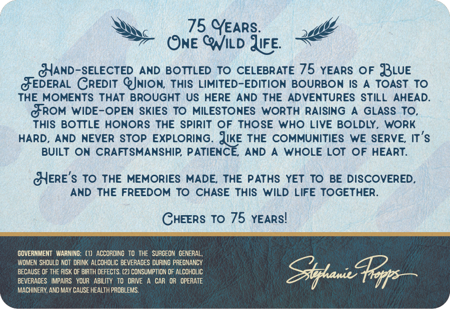
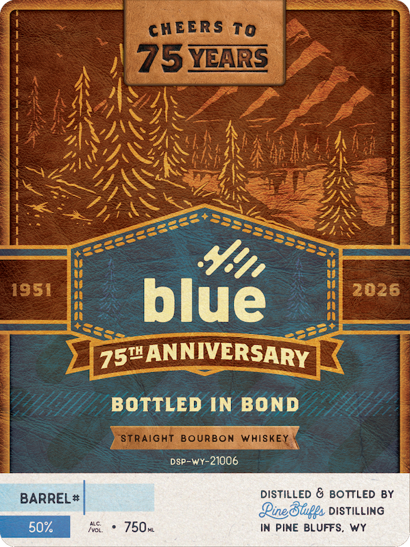

# TTB COLA Label Images - TTBID 26089001000244

**Brand Name:** PINE BLUFFS DISTILLING

**Fanciful Name:** BLUE 75TH ANNIVERSARY

**Issue Date:** 03/30/2026

**Origin Code:** 49

**Product Class/Type:** 119

**Source:** [TTB Public COLA Registry](https://ttbonline.gov/colasonline/viewColaDetails.do?action=publicFormDisplay&ttbid=26089001000244)

## Label Images

### Back Label

### Front Label

## Extracted Label Text

*Text extracted via OCR - may contain errors*

**Detected Proof:** 100

### Back Label

75 YEARS:
ONE QNILD JFE:
JIAND-SELECTED AND BOTTLED To CELEBRATE 75 YEARS OF BLuE
GEDERAL CREDIT @JNIOn; THIS LIMITED-EDITION BOURBON IS
A TOAST To
THE MOMENTS THAT BRought US HERE
AND THE
ADVENTURES STILL AHEAD
GROM WIDE-OPEN
SKIES TO
MILESTONES WORTH
RAISING
GLASS TO,
This BOTTLE HONORS THE SpirIT OF
THOSE
Who LIVE BOLDLY_
WORK
HARD, AND NEVER STOP EXPLORING. JiKE THE COMMUNITIES WE SERVE, IT'$
BUILT
ON
CRAFTSMANSHIP PATIENCE,
AND
WHOLE LOT
OF
HEART:
BYERE'$ To THE MEMORIES MADE THE PATHS YET TO BE DISCOVERED_
AND THE FREEDOM To CHASE This WiLd LIFE TOGETHER_
CHEERS To 75 YEARSI
GOVERNMENT  WARNING:
ACCORDING
TO THE  SURGEON  GENERAL
WOMEN SHOULD NOT  DRINK ALCOHOLIC BEVERACES DURING PREGNANCY
BECAUSE OF THE RISK OF BIRTH DEFECTS. (2] CONSUMPTION OF ALCOHOLIC
BEVERAGES   IMPAIRS   YOUR
ABILITY   TO
DRIVE
CAR   OR   OPERATE
MACHINERY,AND MAY CAUSE HEALTH PROBLEMS
Zxhani
Noxf

### Front Label

CHEERS To
75YARS
Y8/
1951
2026
blue
ANNIVERSARY
BOTTLED IN BOND
Straight Bourbon Whiskey
DSP-WY-
21006
BARREL #
DIStiLLEd & BOTTLED BY
Pine 8uggs DISTILLING
50%
750m
In PINE BLUFFS
WY
75t4
