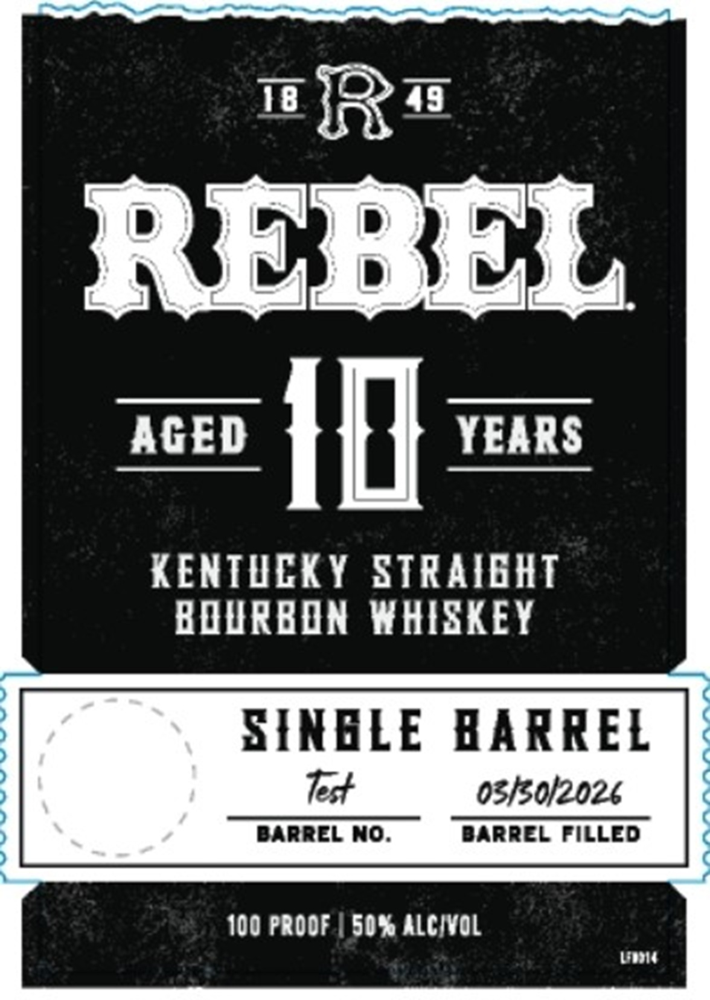
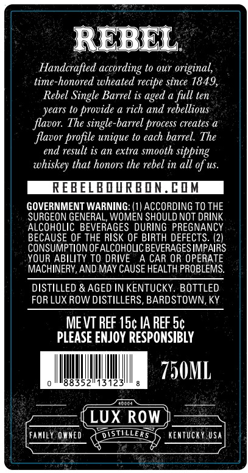
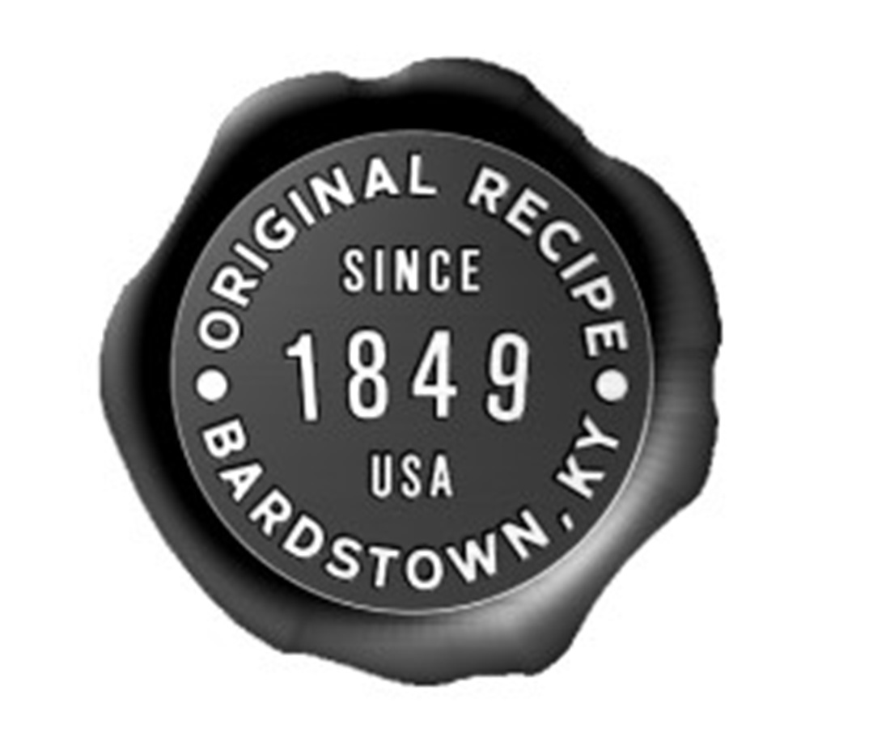

# TTB COLA Label Images - TTBID 26089001000486

**Brand Name:** REBEL

**Issue Date:** 03/30/2026

**Origin Code:** 29

**Product Class/Type:** 101

**Source:** [TTB Public COLA Registry](https://ttbonline.gov/colasonline/viewColaDetails.do?action=publicFormDisplay&ttbid=26089001000486)

## Label Images

### Label 1

### Label 2

### Label 3

### Label 4

## Extracted Label Text

*Text extracted via OCR - may contain errors*

*1 image(s) excluded: text did not meet readability threshold*

**Detected Proof:** 100

### Label 1

"R"
REBEL
AGED
ID
YEARS
KENTDEKY STRAIEHT
BDURBDN WHISKEY
SIKELE
BARREL
03130/2026
BARREL No.
BaRREL FILLED
100 PRODF
50% ALCIVOL
Lubia
Tes

### Label 2

REBEL
Handcrafted according to our original,
time-honored wheated recipe since 1849,
Rebel Single Barrel is aged a full ten
years to
provide a rich and rebellious
flavor. The single-barrel process creates a
flavor profile unique to each barrel The
end result is an extra smooth sipping
whiskey that honors the rebel in all of us.
REBEBDRBON@
GOVERNMENT WARNING: (1| ACCORDING TO THE
SURGEON GENERAL, WOMEN SHOULD NOT DRINK
ALCOHOLIC BEVERAGES DURING PREGNANCY
BECAUSE OF THE RISK OF BIRTH DEFECTS. (2)
CONSUMPTION OFALCOHOLIC BEVERAGESIMPAIRS
YOUR ABILITY TO DRIVE
A CAR OR OPERATE
MACHINERY,AND MAY CAUSE HEALTH PROBLEMS:
DISTILLED & AGED IN KENTUCKY. BOTTLED
FOR LUX ROW DISTILLERS, BARDSTOWN, KY
ME VT REF 15c IA REF Sc
PLEASE ENJOY RESPONSIBLY
750ML
883521/13123
Loona
LUX Row
Family OWMED
DISTILLERS
KentucKY Usa

### Label 3

AGED at YEARS AGED adi YEARS
