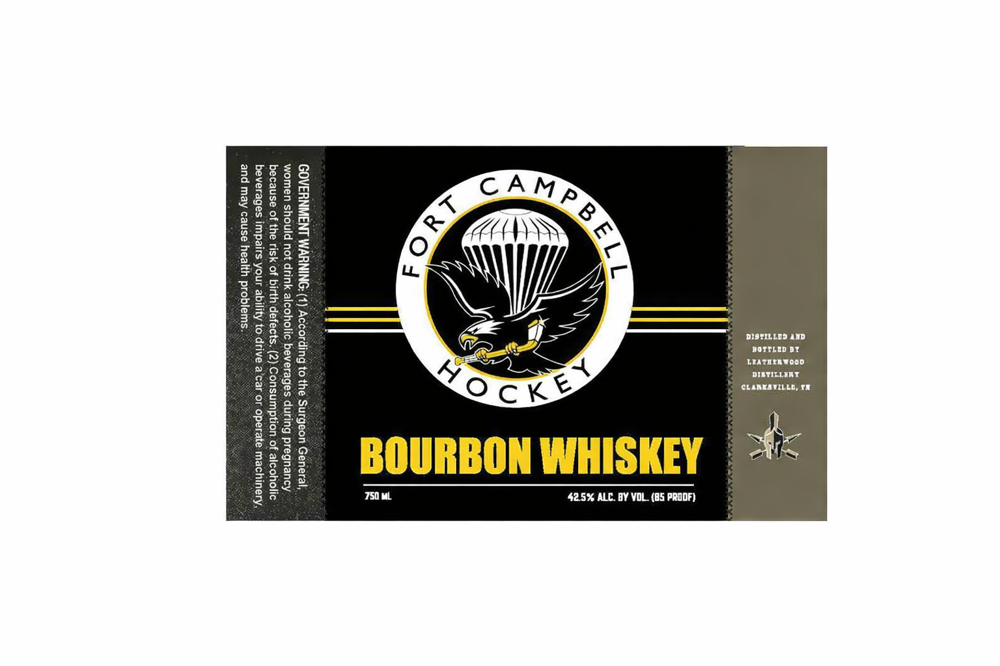

# TTB COLA Label Images - TTBID 26089001000493

**Brand Name:** FT. CAMPBELL

**Fanciful Name:** HOCKEY

**Issue Date:** 04/15/2026

**Origin Code:** 43

**Product Class/Type:** 141

**Source:** [TTB Public COLA Registry](https://ttbonline.gov/colasonline/viewColaDetails.do?action=publicFormDisplay&ttbid=26089001000493)

## Label Images

### Label 1

## Extracted Label Text

*Text extracted via OCR - may contain errors*

### Label 1

‘BOTTLED BY
LEATHERWOOD

‘CLAWKAYILLE, 1

-
5
=
ie
FI
x
q

—
ee]
ES
zB
=
eS
S
=)
es
—
S&S
e&

GOVERNMENT WARNII ) According to the Surgeon General,
women should not drink alcoholic beverages during pregnancy
because of the risk of birth’ defects. (2) Consumption of alcoho
beverages impairs your ability to drive a’car or operate machinery,
and may cause health problems.
