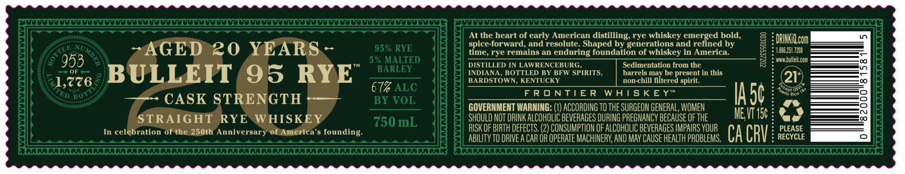
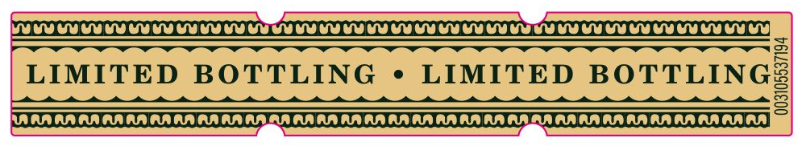
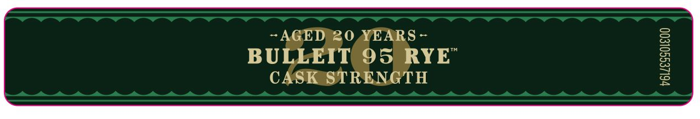

# TTB COLA Label Images - TTBID 26089001000528

**Brand Name:** BULLEIT

**Issue Date:** 03/31/2026

**Origin Code:** 22

**Product Class/Type:** 102

**Source:** [TTB Public COLA Registry](https://ttbonline.gov/colasonline/viewColaDetails.do?action=publicFormDisplay&ttbid=26089001000528)

## Label Images

### Label 1

### Label 2

### Label 3

## Extracted Label Text

*Text extracted via OCR - may contain errors*

**Detected Proof:** 134
**Detected Age:** 20 Years

### Label 1

At the heart of early American distilling, rye whiskey emerged bold,
DRIHKILcom
AGED 20 YEARS
95% RYE
iice Foe rerdainsdan eodutring foxadatiog Derathoskeynd reneeid by
0
1.866251.7200
953
5% MALTED
DISTILLED IN LAWRENCEBURG
Sedimentation from the
Ww bulleiecCm
BULLEIT
95 RYE
BARLEY
INDIANA
BOTTLED BY BFW SPIRITS,
barrels may be present in this
21
1,776
BARDSTOWN, KENTUCKY
non-chill filtered spirit:
BO
67% ALC
F R 0NTIE R
W AISK E Yt
IA5c
Ler3RiCo
CASK STRENGTH
BY VOL
GOVERNMENT WARNING: (1) ACCORDING TO THE SURGEON GENERAL, WOMEN
STRAIGHT RYE WHISKE
750 mL
SHOULD NOT DRINK ALCOHOLIC BEVERAGES DURING PREGNANCY BECAUSE OF THE
ME VT 156
In celebration of the 250th Anniversary of America' $
founding
RISK OF BIRTH DEFECTS, (2) CONSUMPTION OF ALCOHOLIC BEVERAGES IMPAIRS VOUR
CA CRV
PLEASE
ABILITV TO dRIVE A CAR OR OpeRATe MAChInERY, AND MAY Cause health PROBLeMS;
RECYCLE
Ana
UMBEI
TED

### Label 2

WUUU UU UU SY Lu EU LU UYU LULU UU UU LULU LUCY LULU UYU UU TU UU UU UU UU LU UYU OUI
LIMITED BOTTLING ¢ LIMITED BOTTLING!
RRR AR AA RA AA AAA RATA TARA RANA KARA AA AA ARAN AN AARA RAR AR AD AR AR ANA OA IS

### Label 3

AGED 20
EARS
BULLEIT 95 RYE
1
CASK STRENGTH
