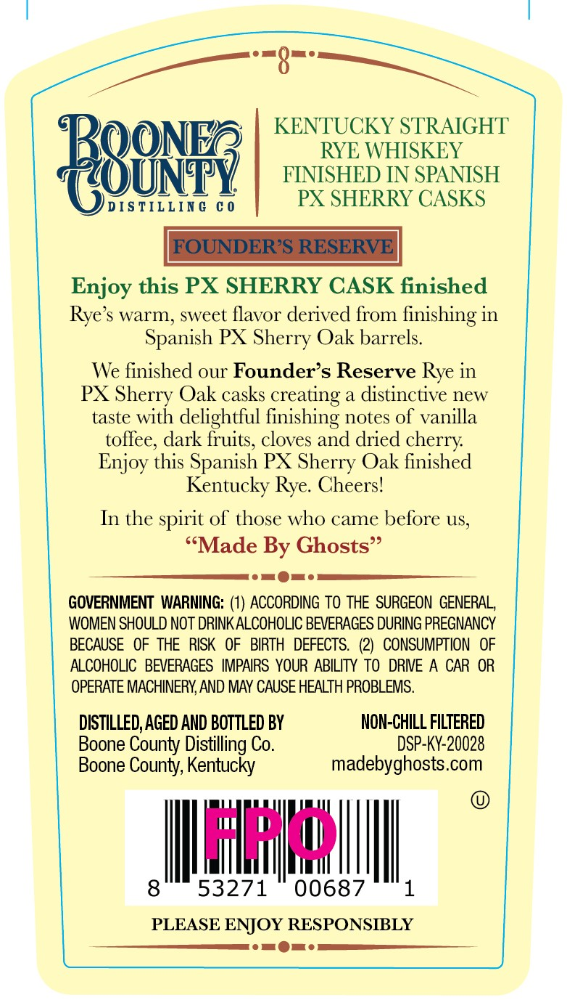
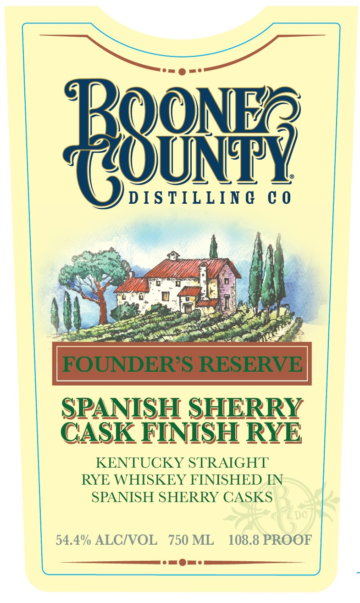
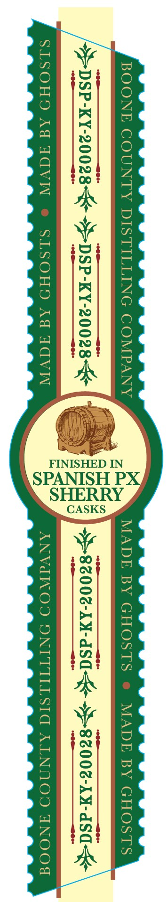

# TTB COLA Label Images - TTBID 26089001000591

**Brand Name:** FOUNDER'S RESERVE

**Issue Date:** 04/22/2026

**Origin Code:** 22

**Product Class/Type:** 102

**Source:** [TTB Public COLA Registry](https://ttbonline.gov/colasonline/viewColaDetails.do?action=publicFormDisplay&ttbid=26089001000591)

## Label Images

### Back Label

### Front Label

### Label 3

## Extracted Label Text

*Text extracted via OCR - may contain errors*

**Detected Proof:** 108.8

### Back Label

KENTUCKY STRAIGHT
BB8N53
FINISHED HSSENISH
DIS TILLIN G
C 0
PX SHERRY CASKS
FOUNDERS RESERVE
Enjoy this PX SHERRY CASK finished
Rye's warm, sweet flavor derived from finishing in
Spanish PX Sherry Oak barrels:
We finished our Founder s Reserve Rye in
PX Sherry Oak casks creating a distinctive new
taste with delightful finishing notes of vanilla
toffee; dark fruits, cloves and dried cherry
Enjoy this Spanish PX Sherry Oak finished
Kentucky Rye. Cheers!
In the spirit of those who came belore US,
{Made By Ghosts"
GOVERNMENT  WARNING: (1) ACCORDING To THE   SURGEON  GENERAL
WOMEN SHOULD NOT DRINK ALCOHOLIC BEVERAGES DURING PREGNANCY
BECAUSE   OF THE   RISK
OF   BIRTH   DEFECTS.   (2)
CONSUMPTION   OF
ALCOHOLIC
BEVERAGES   IMPAIRS YOUR ABILITY To   DRIE A CAR OR
OPERATE MACHINERY AND MAY CAUSE HEALTH PROBLEMS.
DISTILLED,AGED AND BOTTLED BY
NON-ChILL FILTERED
Boone County Distilling Co.
DSP-KY-20028
Boone County, Kentucky
madebyghosts.com
lazd
8
53271
00687
PLEASE ENJOY RESPONSIBLY

### Front Label

Beonz
D IS TILLIN @
0 0
FOUNDER?S RESERVE
SPANISH SHERRY
CASK FINISH RYEE
KENTUCKY STRAIGHT
RYE WHISKEY FINISHED IN
SPANISH SHERRY CASKS
54.4% ALCIVOL
750 ML
108.8 PROOF

### Label 3

BOO! COUNTY DISTI x COMPANY GHOSTS e MADE

“S>-DSP-KY-20028- +$-DSP-KY-20028 E 008-k4-dSa

FINISHED IN
SHERRY

PANISH PX,

SLSOHD Ad ACVW © SLSOHD Ad TAVW ANVdWOD ONITILSIG ALNNOD ANOO

¢
