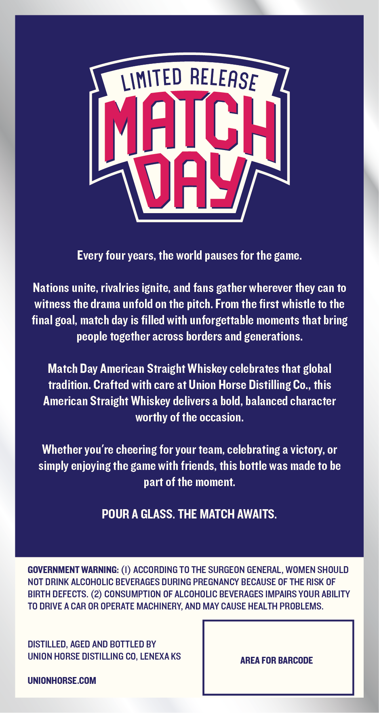
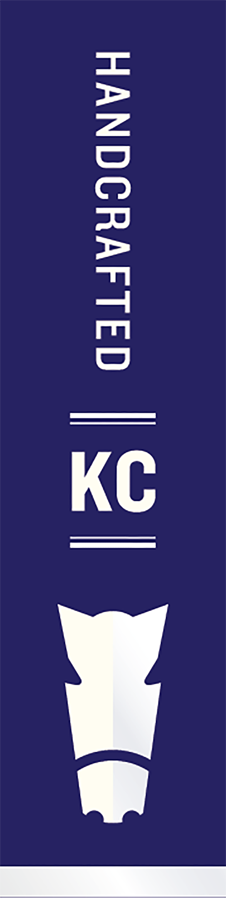

# TTB COLA Label Images - TTBID 26089001000602

**Brand Name:** UNION HORSE DISTILLING CO MATCH DAY

**Issue Date:** 03/31/2026

**Origin Code:** 21

**Product Class/Type:** 100

**Source:** [TTB Public COLA Registry](https://ttbonline.gov/colasonline/viewColaDetails.do?action=publicFormDisplay&ttbid=26089001000602)

## Label Images

### Back Label

### Front Label

### Label 3

## Extracted Label Text

*Text extracted via OCR - may contain errors*

*2 image(s) excluded: text did not meet readability threshold*

### Back Label

MATCH
OaY
Every four years, the world pauses for the game:
Nations unite, rivalries ignite; and fans gather wherever they can to
witness the drama unfold on the pitch. From the first whistle to the
final goal, match day is filled with unforgettable moments that bring
people together across borders and generations.
Match Day American Straight Whiskey celebrates that global
tradition. Crafted with care at Union Horse Distilling Co., this
American Straight Whiskey delivers a bold, balanced character
worthy of the occasion:
Whether you're cheering for your team; celebrating a victory, or
simply enjoying the game with friends, this bottle was made to be
part of the moment.
POUR A GLASS. THE MATCH AWAITS.
GOVERNMENT WARNING: (0) ACCORDING TO THE SURGEON GENERAL, WOMEN SHOULD
NOT DRINK ALCOHOLIC BEVERAGES DURING PREGNANCY BECAUSE OF THE RISK OF
BIRTH DEFECTS. (2) CONSUMPTION OF ALCOHOLIC BEVERAGES IMPAIRS YOUR ABILITY
TO DRIVE A CAR OR OPERATE MACHINERY, AND MAY CAUSE HEALTH PROBLEMS
DISTILLED, AGED AND BOTTLED BY
UNION HORSE DISTILLING CO, LENEXA KS
AREA FOR BARCODE
UNIONHORSE.COM
LIMITED
RELEASE
