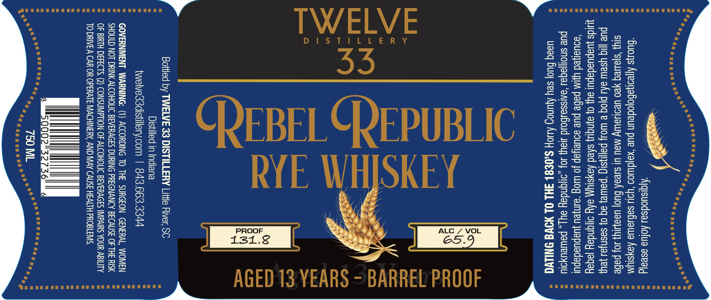

# TTB COLA Label Images - TTBID 26089001000655

**Brand Name:** TWELVE 33 DISTILLERY

**Fanciful Name:** REBEL REPUBLIC

**Issue Date:** 03/31/2026

**Origin Code:** 41

**Product Class/Type:** 142

**Source:** [TTB Public COLA Registry](https://ttbonline.gov/colasonline/viewColaDetails.do?action=publicFormDisplay&ttbid=26089001000655)

## Label Images

### Front Label

## Extracted Label Text

*Text extracted via OCR - may contain errors*

### Front Label

‘Ajqisuodseu Aofua aseajg
‘buoys AjjeonsBojodeun pue esas ‘YOU sefisawe Aaysiy

SIU} ‘sjaueg Yeo UedLeWy Mau UI s1e9A Huo] UaELIU} 40) pabe
PUP ||Iq YSeL 9{1 pjog e Woy pal|lysiq ‘pawe} aq 0} sasnjou yPUY
quids juepuedapul ayy o} ajnquy sked Aaysiyyy aXy o1gndey jeqey
‘goualed jim pabe pue soueijap Jo wog “ainjeu juapuadepul
pue snoljaqed ‘anssaiBoud say} Jo} ,o1|qndey au], PaLUeUyOIU
useq Guo] sey Aunog AUOH $0881 JHL OL NOW ONG

SKEY

EOE CE RY:

1ST

D

TWELVE
33

|
—
=

CREBELCREPUBLIC

Bottled by TWELVE 33 DISTILLERY Little River, SC
Distilled in Indiana
twelve33distillery.com | 843.663.334

GOVERNMENT WARNING: (1) ACCORDING TO THE SURGEON GENERAL, WOMEN
SHOULD NOT DRINK ALCOHOLIC BEVERAGES DURING PREGNANCY BECAUSE OF THE RISK
OF BIRTH DEFECTS. (2) CONSUMPTION OF ALCOHOLIC BEVERAGES IMPAIRS YOUR ABILITY
TO DRIVEA CAR OR OPERATE MACHINERY, AND MAY CAUSE HEALTH PROBLEMS.

AGED 13. YEARS - BARREL PROOF
