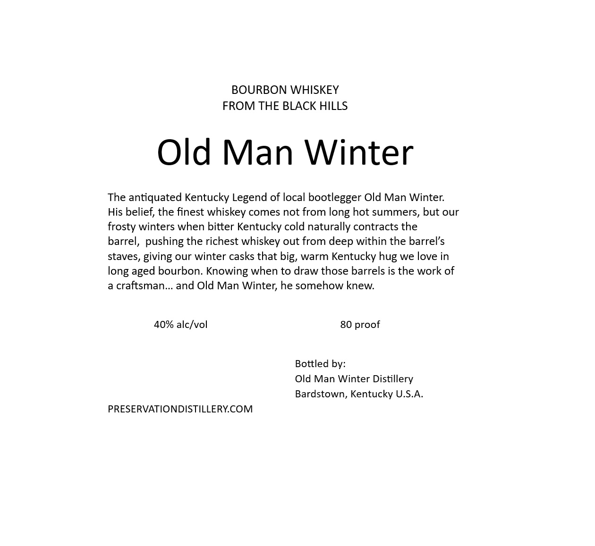
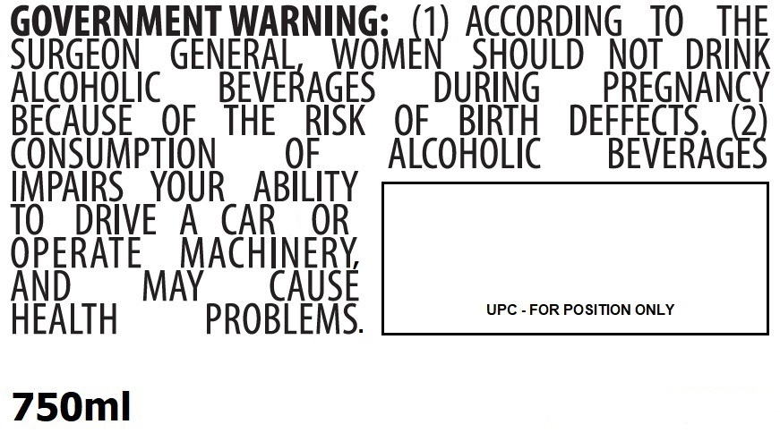

# TTB COLA Label Images - TTBID 26089001000679

**Brand Name:** OLD MAN WINTER

**Issue Date:** 03/31/2026

**Origin Code:** 22

**Product Class/Type:** 141

**Source:** [TTB Public COLA Registry](https://ttbonline.gov/colasonline/viewColaDetails.do?action=publicFormDisplay&ttbid=26089001000679)

## Label Images

### Back Label

### Front Label

### Label 3

## Extracted Label Text

*Text extracted via OCR - may contain errors*

**Detected Proof:** 80

### Back Label

Old Man Winter

KENTUCKY

BOURBON

WHISKEY

BOURBON WHISKEY FROM THE BLACK HILLS

### Front Label

BOURBON WHISKEY
FROM THE BLACK HILLS
Old Man Winter
The antiquated Kentucky Legend of local bootlegger Old Man Winter
His belief; the finest whiskey comes not
long hot summers, but our
frosty winters when bitter Kentucky cold naturally contracts the
barrel, pushing the richest whiskey out from deep within the barrel's
staves, giving our winter casks that big, warm Kentucky
we love in
long aged bourbon: Knowing when to draw those barrels is the work of
a craftsman__ and Old Man Winter; he somehow knew:
40% alckvol
80 proof
Bottled by:
Old Man Winter Distillery
Bardstown, Kentucky U.S.A.
PRESERVATIONDISTILLERYCOM
from
hug"

### Label 3

GOVERNMENT WARNING:
ACCORDING
TO
THE
SURGEON
GENERAL
INGmEr) AGOBD8
NOT
DRINK
AicoHoLic
BEVERAGES
DURiNG
PREGNANCY
BECAUSE
OF
THE
RISK
OF
BIRTH
DEFFECTS
2
CONSUMpTION
OF
Alcohoic
BEVERAGES
IMPAIRS
YOUR
ABILITY
TO
DRIVE
A
CAR
OR
OPERATE
MACHINERY
And
MAY
CAUSE
UPC - FOR POSITION ONLY
HeALTH
PROBLEMS:
750ml
