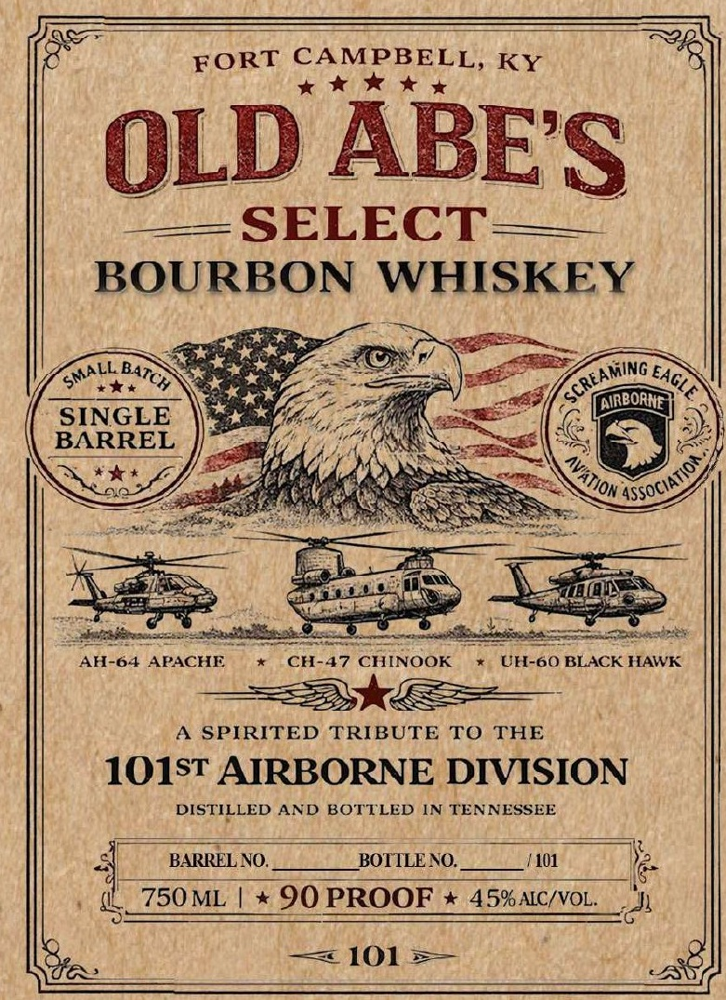
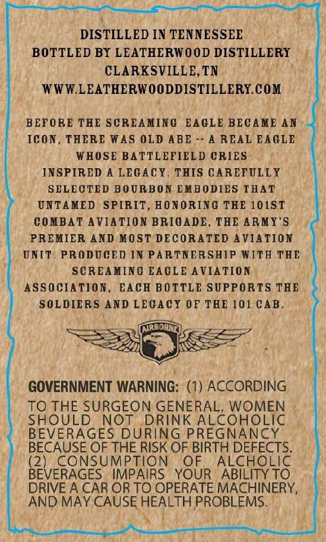

# TTB COLA Label Images - TTBID 26089001000693

**Brand Name:** OLD ABE'S

**Fanciful Name:** SELECT

**Issue Date:** 04/15/2026

**Origin Code:** 43

**Product Class/Type:** 141

**Source:** [TTB Public COLA Registry](https://ttbonline.gov/colasonline/viewColaDetails.do?action=publicFormDisplay&ttbid=26089001000693)

## Label Images

### Front Label

### Label 2

## Extracted Label Text

*Text extracted via OCR - may contain errors*

**Detected Proof:** 90

### Front Label

FORT CAMPBELL, KY
OLD ABES
SELECT
BOURBON
WHISKEY
AIRBORNE |
SINGLE
BARREL
AH-64 APACHE
CH-47 CHINOOK
UH-60 BLACK HAWK
SPIRITED TRIBUTE
TO
THE
101ST AIRBORNE DIVISION
DISTILLED AND BOTTLED IN TENNESSEE
BARREL NO.
BOTTLENO:
LU1
750 ML
90 PROOF
45% AIC/VOL
101
SMALL _
BATCH
SCREAMING ,
, EAGLE
'ASSOCIATIO  =
AVAtion ^

### Label 2

DISTILLED IN TENNESSEE
BOTTLED BY LEATHERWOOD DISTILLERY
CLARKSVILLE,TN
WWWLEATHERWOODDISTILLERY.COM
BEFORE TEE SCREA MING
EAGLE BECA ME AN
ICON
THERE WAS OLD ABE
A REAL AGLE
WHOSE BATTLEFIEL D CRIES
INSPIR ED A LEGACY
THIS CAREFULLY
SELECTED BOURBON EMBODIES THAT
UNTAMED
SPIRIT , HONORINC THE 101ST
C0 MBAT
AVIA TION BRICADE
THE ARMY'S
PREMIER AND MOST DECORATED A VIA TION
UNIT
PRODUCED IN PARTNERSHIP WITA THE
SCREAMING EAGLE AVIA TION
ASS 0 CIA TION
EACH BOTTLE SUPPORTS TEB
SOLDIERS AND LEGAcY OF THE 101 CAB
GOVERNMENT WARNING: (1) ACCORDING
TO THE SURGEON GENERAL, WOMEN
SHOULD
NOT
DRINK
ALcoHoLic
BEVERAGES DURING PREGNANCY
BECAUSE OF THE RISK OF BIRTH DEFECTS
(2)
CONSUMPTION
OF
ALCHOLIC
BEVERAGES
IMPAIRS
YOUR
ABILITY TO
DRIVE A CAR ORTO OPERATE MACHINERY,
AND MAY CAUSE HEALTH PROBLEMS.
