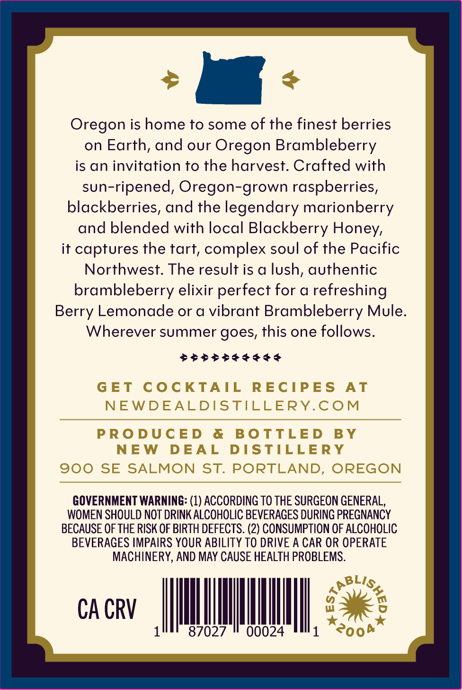
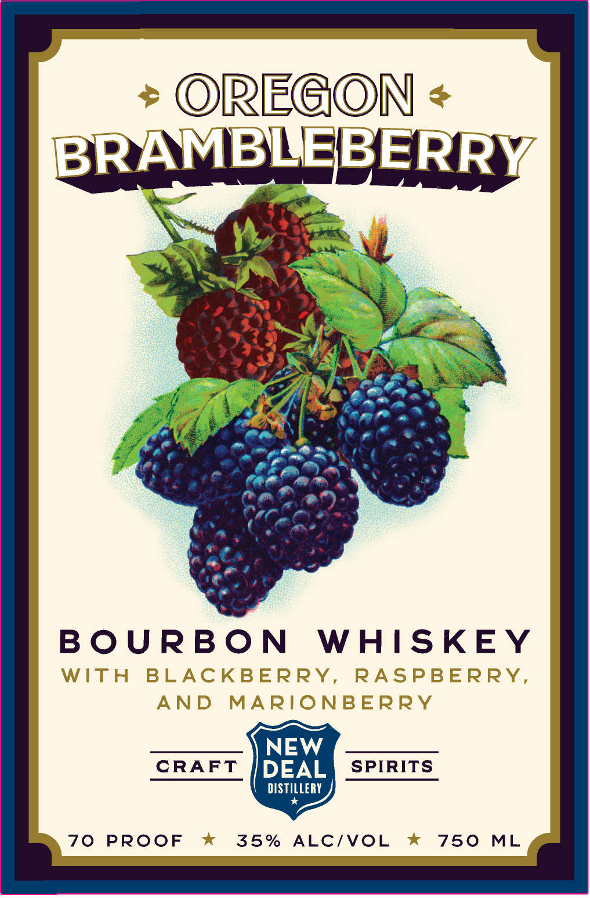

# TTB COLA Label Images - TTBID 26089001000801

**Brand Name:** NEW DEAL DISTILLERY

**Fanciful Name:** OREGON BRAMBLEBERRY

**Issue Date:** 04/23/2026

**Origin Code:** 38

**Product Class/Type:** 149

**Source:** [TTB Public COLA Registry](https://ttbonline.gov/colasonline/viewColaDetails.do?action=publicFormDisplay&ttbid=26089001000801)

## Label Images

### Back Label

### Front Label

## Extracted Label Text

*Text extracted via OCR - may contain errors*

**Detected Proof:** 140

### Back Label

Oregon is home to some of the finest berries

on Earth, and our Oregon Brambleberry

is an invitation to the harvest. Crafted with

sun-ripened, Oregon-grown raspberries,

blackberries, and the legendary marionberry

and blended with local Blackberry Honey,

it captures the tart, complex soul of the Pacific

Northwest. The result is a lush, authentic

brambleberry elixir perfect for a refreshing

Berry Lemonade or a vibrant Brambleberry Mule

Wherever summer goes, this one follows

SSSSSESSSESS

GOVERNMENT WARNING: (1) ACCORDING TO THE SURGEON GENERAL,

WOMEN SHOULD NOT DRINK ALCOHOLIC BEVERAGES DURING PREGNANCY

BECAUSE OF THE RISK OF BIRTH DEFECTS. (2) CONSUMPTION OF ALCOHOLIC

BEVERAGES IMPAIRS YOUR ABILITY TO DRIVE A CAR OR OPERATE

MACHINERY, AND MAY CAUSE HEALTH PROBLEMS.

CACRV |

il

ll

87027

00024

Ie

### Front Label

ORECON
8
BRAMBLEBERRY
B O URBO N
WHISKEY
WITH
BLACKBERRY
RASPBERRY,
AND
MARIONBERRY
NEW
CRAFT
DEAL
SPIRITS
DISTILLERY
70
PROOF
35%
ALCIVOL
750
ML
