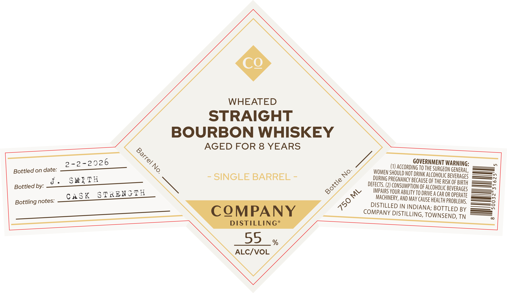

# TTB COLA Label Images - TTBID 26089001000858

**Brand Name:** COMPANY DISTILLING

**Fanciful Name:** SINGLE BARREL

**Issue Date:** 04/03/2026

**Origin Code:** 43

**Product Class/Type:** 101

**Source:** [TTB Public COLA Registry](https://ttbonline.gov/colasonline/viewColaDetails.do?action=publicFormDisplay&ttbid=26089001000858)

## Label Images

### Label 1

### Label 2

## Extracted Label Text

*Text extracted via OCR - may contain errors*

*1 image(s) excluded: text did not meet readability threshold*

**Detected Proof:** 110
**Detected Age:** 8 Years

### Label 1

CQ
WHEATED
STRAIGHT
BOURBON WHISKEY
AGED FOR 8 YEARS
2-2-2026
1o
(VJ accordigoto RMuRGec
MERGEONGENERG;
Bottled on date:
WOMENSHOULD NOT DRnOK HecohcGeobegereRGes
J
SMfTH
SINGLE BARREL
pecngeeegnc BecauseoeohouGBeneBhgth
Bottled by:
deFEPI R2 GoNSUMPTON OE ALcoholac BEveRAGEH
CASK
STRENJTH
c
IMpaRS VOUR ABiLTV To DRNE ^ CAR OR opERATE
Bottling notes:
MACHERV, AND May CAUSE health PRobeemse
DISTILLED JN INDIANA; BOTTLED BY
CQMPANY
COMPANY DISTILLING, TOWNSEND, TN
DISTILLING
55
%
ALCIVOL
1
THE =
No.
Bottle
750
