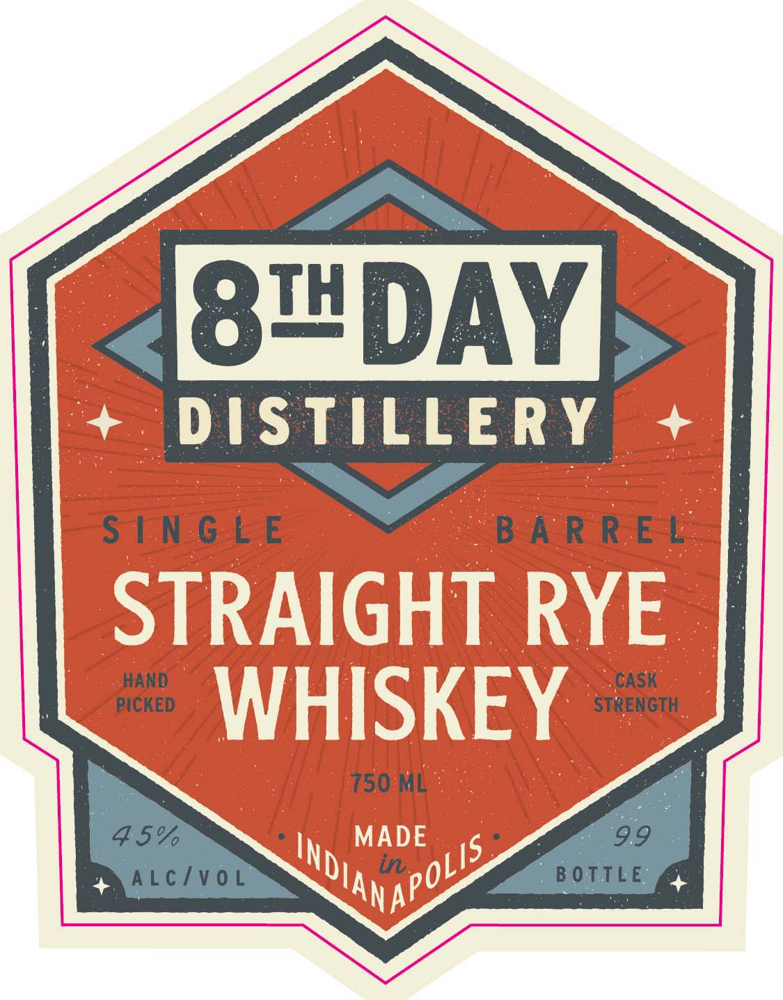
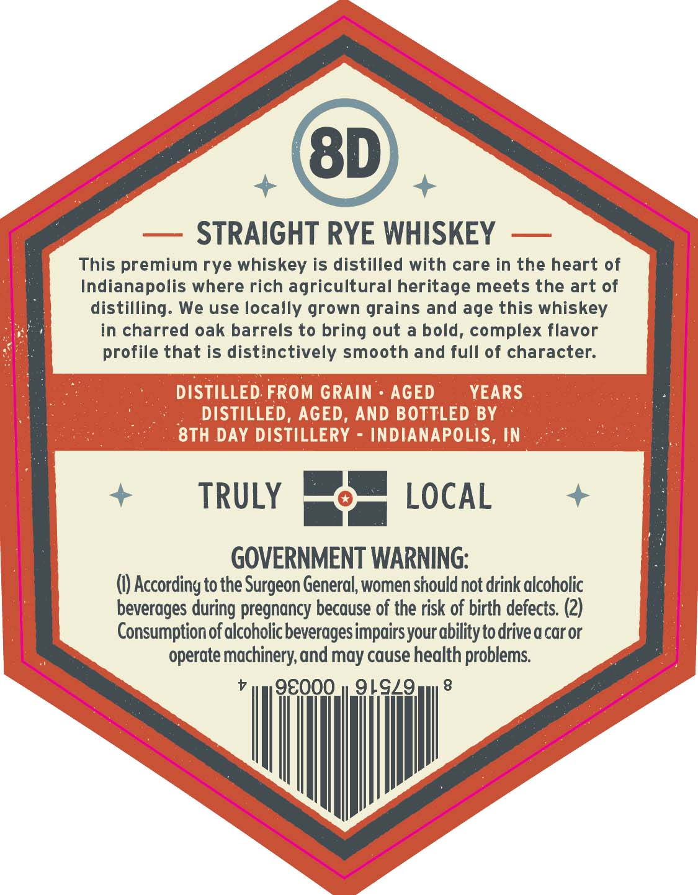

# TTB COLA Label Images - TTBID 26090001000047

**Brand Name:** 8TH DAY DISTILLERY

**Issue Date:** 04/01/2026

**Origin Code:** 19

**Product Class/Type:** 102

**Source:** [TTB Public COLA Registry](https://ttbonline.gov/colasonline/viewColaDetails.do?action=publicFormDisplay&ttbid=26090001000047)

## Label Images

### Label 1

### Label 2

## Extracted Label Text

*Text extracted via OCR - may contain errors*

### Label 1

is@!DAY

DIST rut ERY

Ses

Ree

PICKED

HAND

STRENGTH

CASK

750 ML

### Label 2

8D
STRAIGHT RYE WHISKEY
This premium rye whiskey is distilled with care in the heart of
Indianapolis where rich agricultural heritage meets the art of
distilling. We use locally grown grains and age this whiskey
in charred oak barrels to bring out a bold, complex flavor
profile that is distinctively smooth and full of character:
DISTILLED FROM GRAIN
AGED
YEARS
DISTILLED, AGED, AND BOTTLED BY
8TH DAY DISTILLERY
INDIANAPOLIS, IN
TRULY
LOCAL
GOVERNMENT WARNING;
() According to the Surgeon General, women should not drink alcoholic
beverages during pregnancy because of the risk of birth defects: (2)
Consumptionof alcoholic beveragesimpairs your abilitytodrivea car or
operate machinery,and may cause health problems
98000
91929
