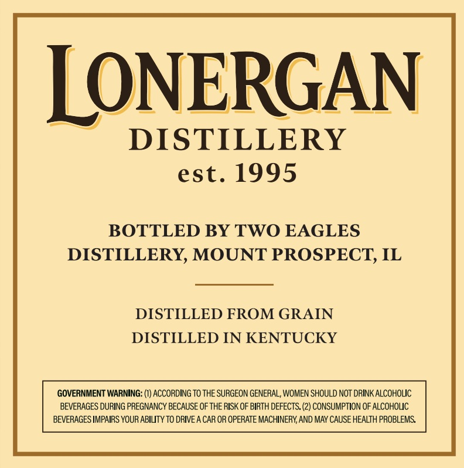
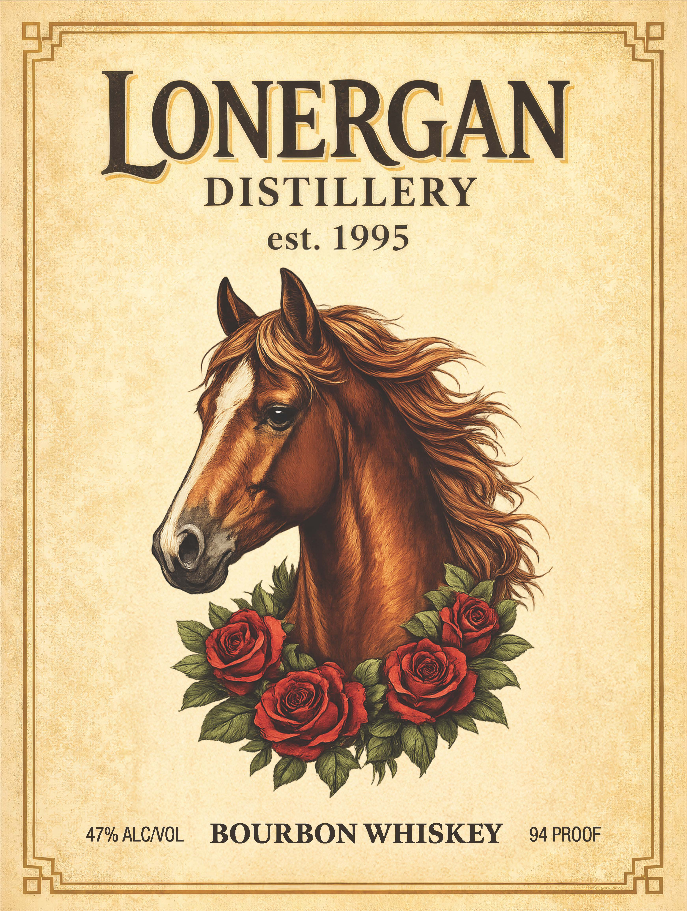

# TTB COLA Label Images - TTBID 26090001000100

**Brand Name:** LONERGAN

**Issue Date:** 03/31/2026

**Origin Code:** 04

**Product Class/Type:** 141

**Source:** [TTB Public COLA Registry](https://ttbonline.gov/colasonline/viewColaDetails.do?action=publicFormDisplay&ttbid=26090001000100)

## Label Images

### Back Label

### Front Label

## Extracted Label Text

*Text extracted via OCR - may contain errors*

*1 image(s) excluded: text did not meet readability threshold*

### Back Label

LONERGAN
DISTILLERY
est. 1995
BOTTLED BY TWO EAGLES
DISTILLERY; MOUNT PROSPECT; IL
DISTILLED FROM GRAIN
DISTILLED IN KENTUCKY
GOVERNMENT WARNING: (I) ACCORDING TO THE SURGEON GENERAL; WoMEN SHOULD NOT drINK ALCOHOLIC
BEVERAGES DURING PREGNANCY BECAUSE OF THE RISK OF BIRTH DEFECTS. (2) CONSUMPTION OF ALCOHOUC
BEVERAGES IMPAIRS YOUR ABILTY TO DRIVE A CAR OR OPERATE MACHINERY AND MAY CAUSE HEALTH PROBLEMS
