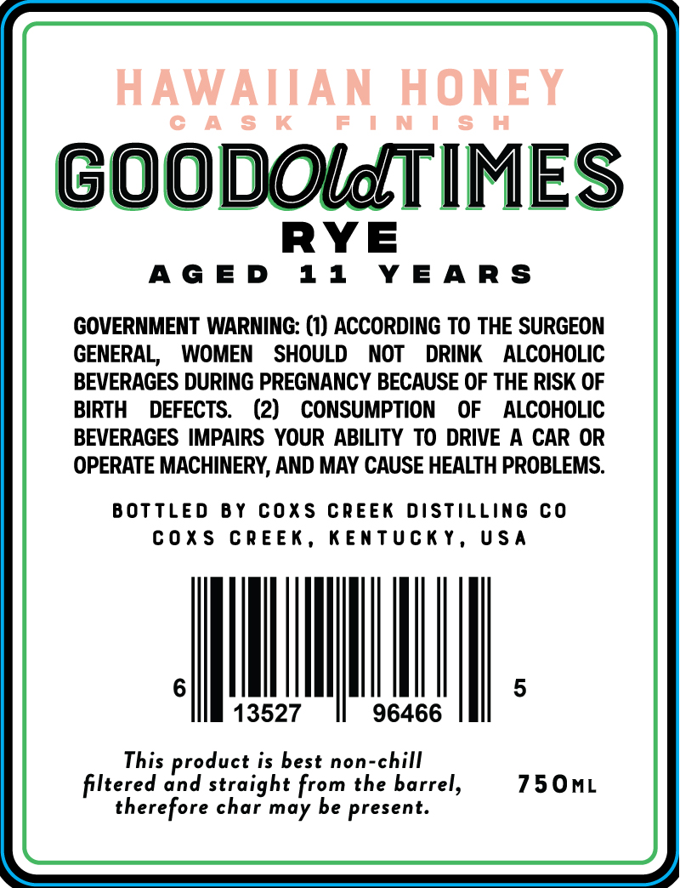
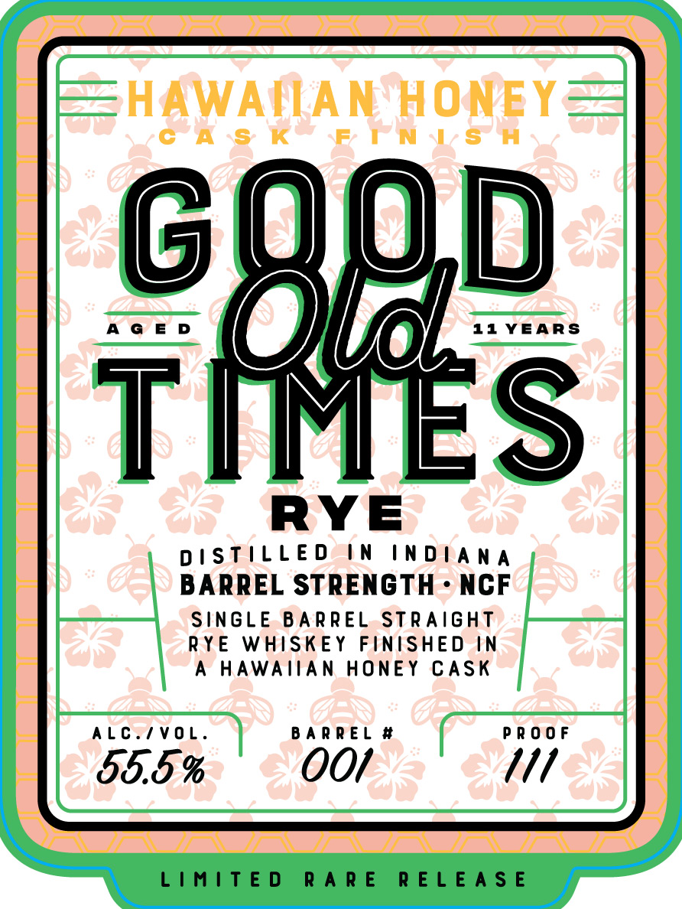

# TTB COLA Label Images - TTBID 26090001000192

**Brand Name:** GOOD OLD TIMES RYE

**Fanciful Name:** HAWAIIAN HONEY

**Issue Date:** 03/31/2026

**Origin Code:** 22

**Product Class/Type:** 102

**Source:** [TTB Public COLA Registry](https://ttbonline.gov/colasonline/viewColaDetails.do?action=publicFormDisplay&ttbid=26090001000192)

## Label Images

### Back Label

### Front Label

## Extracted Label Text

*Text extracted via OCR - may contain errors*

**Detected Age:** 11 Years

### Back Label

GOODOldTIMES

RYE

AGED 11 YEARS

GOVERNMENT WARNING: (1) ACCORDING TO THE SURGEON
GENERAL, WOMEN SHOULD NOT DRINK ALCOHOLIC
BEVERAGES DURING PREGNANCY BECAUSE OF THE RISK OF
BIRTH DEFECTS. (2) CONSUMPTION OF ALCOHOLIC
BEVERAGES IMPAIRS YOUR ABILITY TO DRIVE A CAR OR
OPERATE MACHINERY, AND MAY CAUSE HEALTH PROBLEMS.

BOTTLED BY COXS CREEK DISTILLING CO
COXS CREEK, KENTUCKY, USA

13527 96466

This product is best non-chill
filtered and straight from the barrel,
therefore char may be present.

### Front Label

T Aan
DISTILLED IN INDIANA
BARREL STRENGTH - NGF
SINGLE BARREL STRAIGHT
RYE WHISKEY FINISHED IN
A HAWAIIAN HONEY CASK

ALC./VOL. BARREL # PROOF

LIMITED RARE RELEASE
