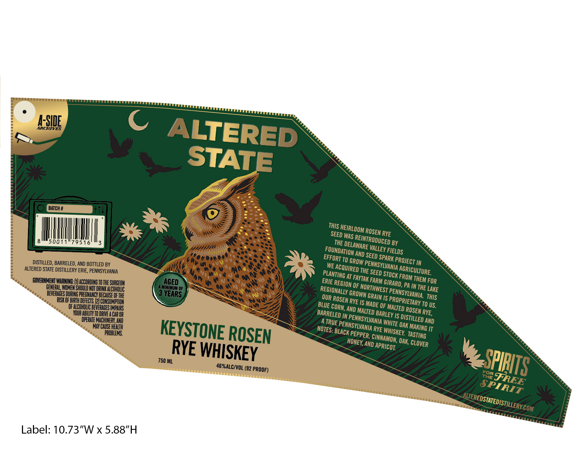

# TTB COLA Label Images - TTBID 26090001000280

**Brand Name:** ALTERED STATE

**Fanciful Name:** KEYSTONE ROSEN RYE WHISKEY

**Issue Date:** 04/08/2026

**Origin Code:** 39

**Product Class/Type:** 142

**Source:** [TTB Public COLA Registry](https://ttbonline.gov/colasonline/viewColaDetails.do?action=publicFormDisplay&ttbid=26090001000280)

## Label Images

### Back Label

### Label 1

## Extracted Label Text

*Text extracted via OCR - may contain errors*

*1 image(s) excluded: text did not meet readability threshold*

**Detected Proof:** 92

### Label 1

ASIDE
C
ALTERED
STATE
BATCH #
THIS HEIRLOOM
WAS
RYE
5081
795
THE
BY
AND
EFFORT TO
DISTILLED , BARRELED, AND BOTTLED BY
WE
ALTERED STATE DISTILLERY ERIE, PENNSYLVANIA
THE SEED
GOVERMMENT WARNING:
ACCORDING IL HHE SURGEON
AGED
ERIE
THEM FOR
Ger shwduoalcohwc
MIMIMuM OF
OF
PA IN THE LAKE
BEVERMBES URINEPREGN LIDECAUSEoedhE
YEARS
GROWN
RISK OF BIRTH DEFECTS
CONSUMPTION
OF COHOUC BEVERAGES IMpARS
AND
OF
To US.
VOUR TBILIUTO ORWE@CAR OR ^
'IS
RYE,
OPERATE MACHUNERI AND
AND
MAY CAUSE HENTH
KEYSTONE _
BLACK
RYE
OAK
PROBLEMS
ROSEN
AND
OAK;
RYE WHISKEY
750 ML
46%ALCIVOL (92 PROOF)
Label: 10.73"W x 5.88"H
ROSEN
SEED "
REINTRODUCED =
DELAWARE
VALLEY
FOUNDATION L
FIELDS
SEED =
SPARK [
PROJECT =
GROW
PENNSYLVANIA
ACQUIRED
AGRICULTURE:
PLANTING
STOCK [
FROM `
FAYTAK
FARM E
GIRARD ,
REGION
NORTHWEST
REGIONALLY =
PENNSYLVANIA:
GRAIN
OUR
ThIS
ROSEN [
PROPRIETARY
RYE
MADE (
BLUE
CORN,
MALTED
ROSEN
MALTED
BARRELED
BARLEY
DISTILLED
PENNSYLVANIA
(TRUE |
WHITE
PENNSYLVANIA
MAKING
NOTES:
WHISKEY:
(PEPPER ,
TASTING
CINNAMON,
HONEY,
'CLOVER
APRICOT
SPIRITS
T82=
FREE
SPIRIT
ALTEREDSTATEDISTILLERYCOM
