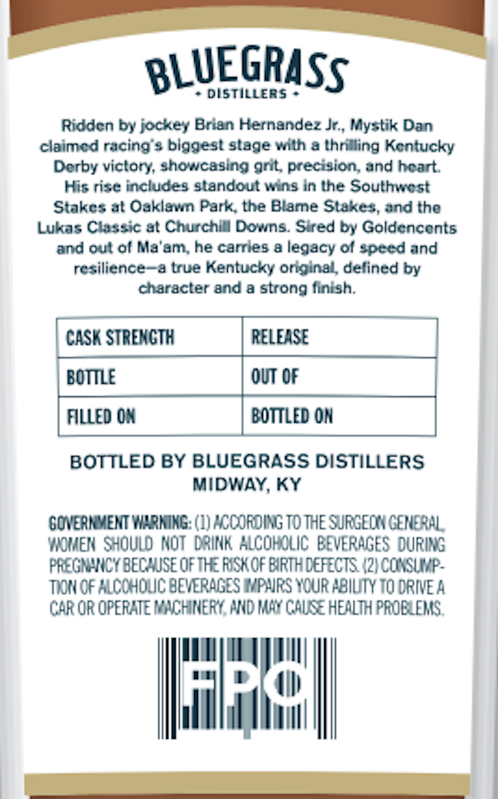
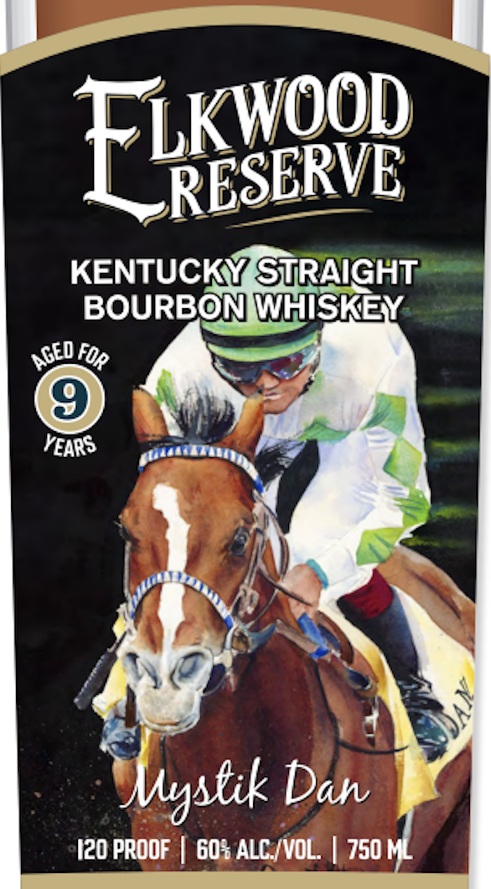
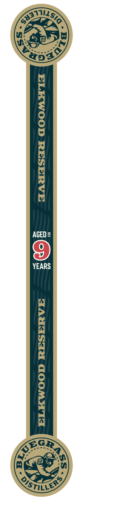

# TTB COLA Label Images - TTBID 26090001000387

**Brand Name:** ELKWOOD RESERVE

**Fanciful Name:** MYSTIK DAN

**Issue Date:** 04/01/2026

**Origin Code:** 22

**Product Class/Type:** 101

**Source:** [TTB Public COLA Registry](https://ttbonline.gov/colasonline/viewColaDetails.do?action=publicFormDisplay&ttbid=26090001000387)

## Label Images

### Back Label

### Front Label

### Label 3

## Extracted Label Text

*Text extracted via OCR - may contain errors*

*1 image(s) excluded: text did not meet readability threshold*

**Detected Proof:** 120

### Back Label

BLUEGRASS
DISTILLERS
Riddcn by jockey Brien Hernendez Jr,, Mystik Dan
claimcd racing $ biggest staqe vith & lhrilling Kcntucky
Dcrby victory, showcasing nrt precision and hcart
His rise includes slandoutuins in Ihe Southicst
Stakcs at Oaklavn Park the Blame Stake :, and tho
Lukas Claszic at Churchlll Dovns Sred by Goldenconts
and out ol Ma'am, he carrles & leqacy ol speed and
rcsilience
3 true Kentucky onginel delined by
character ad 0 strong finish:
CASK STREMCTH
RELEASE
BoTTLE
OUT OF
filled OX
BOTTLed OM
BOTTLED BY BLUEGRASS DISTILLERS
MIDWAY, KY
GOVERMMENT WXBNING: (1) 'Coj6oinG To THe SJRGEC GERERAL
YIMeN  Shqulo Mot LSink AlcohIlic BEVERAGES DURING
PREGRHRICY BEC SE Of THE Fskof EIRTH CEFECTS /21 COKSUP-
TIZN OF KLCCHOLC BEVERAGES WPNRS VCUR PBIUTY T0 ORIE A
CAR OR OPERATE KCHINEF< NUD MAA CAUSE HEALTH PROELERS,
Ro

### Front Label

Elkyooe
KENTUCKY STRAIGHT
BOURBON WHISKEY
YEARS
Dah
I20 PROOF
60% ALC /VOL
750 ML
AGED F
S FOR
Mgstik
