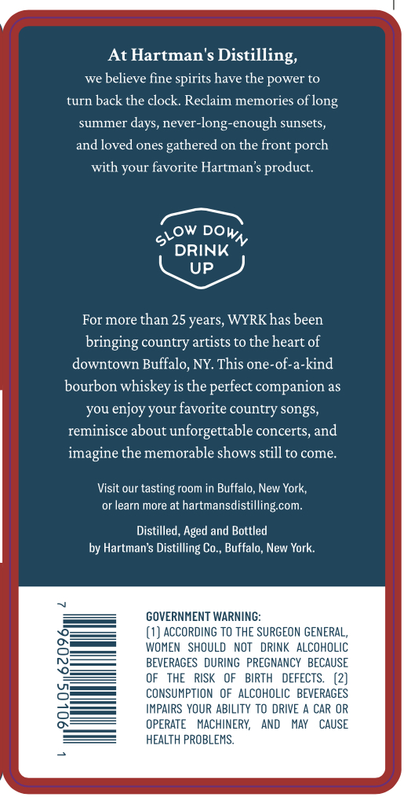
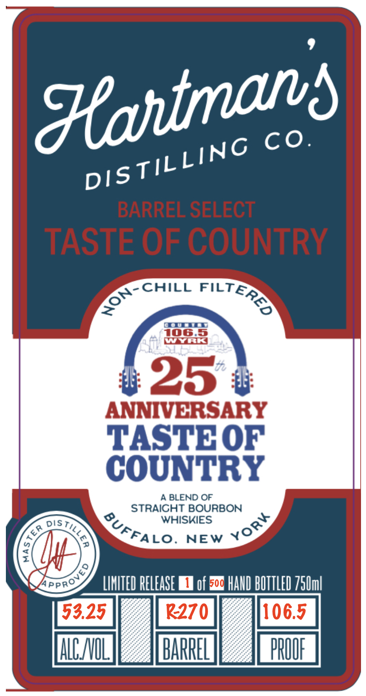

# TTB COLA Label Images - TTBID 26090001000424

**Brand Name:** HARTMAN'S DISTILLING CO.

**Fanciful Name:** TASTE OF COUNTRY

**Issue Date:** 04/03/2026

**Origin Code:** 02

**Product Class/Type:** 121

**Source:** [TTB Public COLA Registry](https://ttbonline.gov/colasonline/viewColaDetails.do?action=publicFormDisplay&ttbid=26090001000424)

## Label Images

### Back Label

### Front Label

### Label 2

## Extracted Label Text

*Text extracted via OCR - may contain errors*

**Detected Age:** 25 Years

### Back Label

At Hartman's
Distilling;
we
believe fine spirits have the power to
turn
back the clock Reclaim memories
summer
'days, never-long-enough sunsets,
and loved ones
gathered
on
the front porch
with your favorite Hartman $ product.
DRINK
UP
For more than 25 years, WYRKhas been
bringing country artists to the heart of
downtown Buffalo, NY. This one-of-a-kind
bourbon whiskey is the perfect companion as
you enjoy your favorite country songs;
reminisce about unforgettable concerts, and
imagine the memorable shows still to come:
Visit our tasting room in Buffalo, New York;
or learn more at
hartmansdistillingcom:
Distilled, Aged and Bottled
by Hartman's Distilling Co , Buffalo, New York:
GOVERNMENT WARNING:
ACCORDING To THE SURGEON GENERAL_
WOMEN  SHOULd NOt   dRINK ALCOHOLIC
BEVERAGES   DURING   PREGNANCY   BECAUSE
THE
RISK
OF   BIRTH   DEFECTS.
CONSUMPTION OF ALCOHOLIC   BEVERAGES
IMPAIRS YOUR ABILITY TO DRIVE
CAR OR
OPERATE
MACHINERY,
And
MAY
CAUSE
HEALTH PROBLEMS;
of long
slow
DoWN

### Front Label

Hahtmans
Co.
BARREL SELECT
TASTE OF COUNTRY
CHILL
@umanar
106.5
WUDLS
25 #
ANNIVERSARY
TASTBOF
COUNTRY
A BLEND OF
STRAICHT BOURBON
DIS
WHISKIES
NEW
LIMITED RELEASE
of 5o4 HAI BUTTLED 75Uml
53.25
R270
106.5
ALNIL
BARREL
PROUF
TILLING
DIS
FILTERES
NON-
BUFFALO.
Yorv
0
6
arprovc

### Label 2

7.97
yay
Be
in
B17
—_—
DRT
PET
BLY
DEL
DAZ
Dsy
Bm
