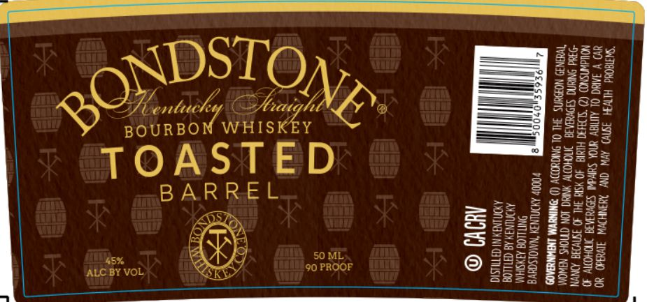

# TTB COLA Label Images - TTBID 26090001000558

**Brand Name:** BONDSTONE

**Fanciful Name:** TOASTED

**Issue Date:** 04/06/2026

**Origin Code:** 22

**Product Class/Type:** 141

**Source:** [TTB Public COLA Registry](https://ttbonline.gov/colasonline/viewColaDetails.do?action=publicFormDisplay&ttbid=26090001000558)

## Label Images

### Label 1

## Extracted Label Text

*Text extracted via OCR - may contain errors*

**Detected Proof:** 90

### Label 1

SZ

SEE

s

sf

S23u2

=a

DSTO

Zee

bad

O

Dh bloke & bik

‘G

Vn.

Sa

n@ee

Bay

Haw

RQ’

BOURBON WHISKEY

22

535

gsis_

TOASTED

BARREL

Hs

on2 =

Bae

=a

23Sc

5%

aor

a

50 ML.

z@=sS

S238

ALC BY VOL.

C4

Ke

90 PROOF

Oz

Ss

226

S355
