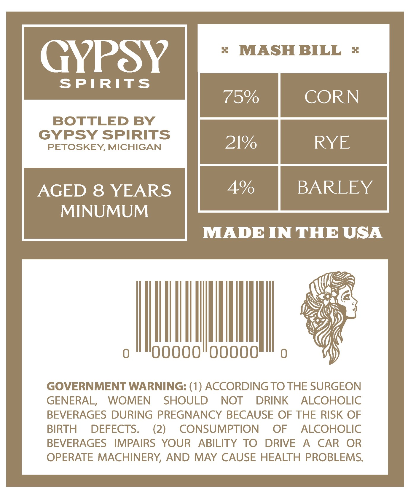
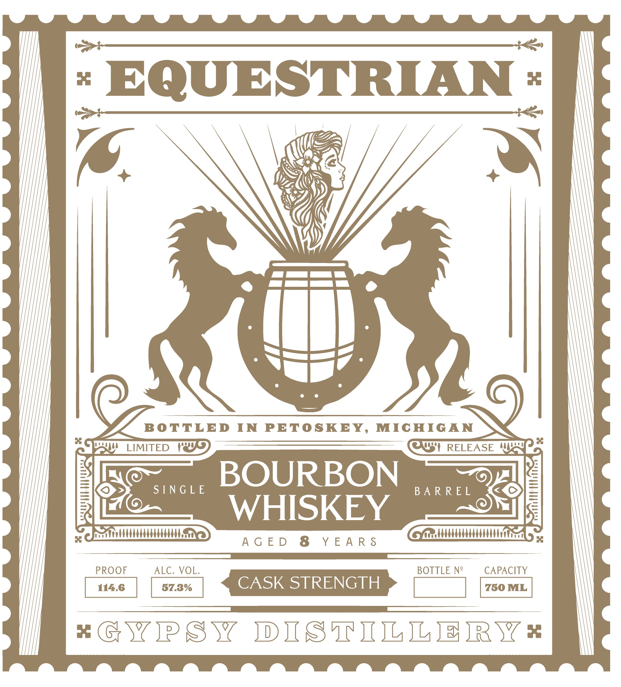

# TTB COLA Label Images - TTBID 26090001000559

**Brand Name:** EQUESTRIAN

**Issue Date:** 04/01/2026

**Origin Code:** 06

**Product Class/Type:** 141

**Source:** [TTB Public COLA Registry](https://ttbonline.gov/colasonline/viewColaDetails.do?action=publicFormDisplay&ttbid=26090001000559)

## Label Images

### Back Label

### Front Label

## Extracted Label Text

*Text extracted via OCR - may contain errors*

*1 image(s) excluded: text did not meet readability threshold*

**Detected Proof:** 150
**Detected Age:** 8 Years

### Back Label

X
MASH BILL
x
GYPSY
SPIRITS
75%
CORN
BOTTLED BY
GyPSY SPIRITS
PETOSKEY, MICHIGAN
21%
RYE
AGED 8 YEARS
4%
BARLEY
MINUMUM
MADE INTHE USA
0oo0
0ooo0
GOVERNMENT WARNING: (1) ACCORDING TO THE SURGEON
GENERAL,
WOMEN
SHOULD
NOT
DRINK
ALCOHOLIC
BEVERAGES DURING PREGNANCY BECAUSE OF THE RISK OF
BIRTH
DEFECTS.
(2)
CONSUMPTION
OF
ALCOHOLIC
BEVERAGES
IMPAIRS
YOUR
ABILITY TO
DRIVE
A
CAR
OR
OPERATE MACHINERY, AND MAY CAUSE HEALTH PROBLEMS.
