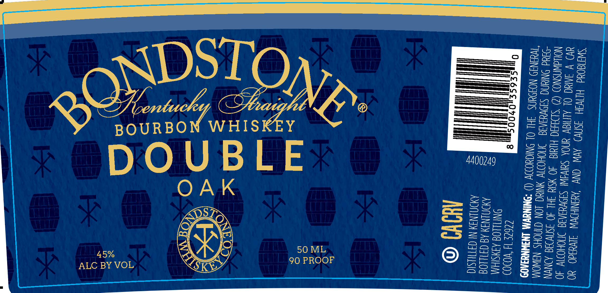

# TTB COLA Label Images - TTBID 26090001000596

**Brand Name:** BONDSTONE

**Fanciful Name:** DOUBLE OAK

**Issue Date:** 04/06/2026

**Origin Code:** 16

**Product Class/Type:** 141

**Source:** [TTB Public COLA Registry](https://ttbonline.gov/colasonline/viewColaDetails.do?action=publicFormDisplay&ttbid=26090001000596)

## Label Images

### Back Label

## Extracted Label Text

*Text extracted via OCR - may contain errors*

**Detected Proof:** 90

### Back Label

SWATEOYd HEVIH 3SN¥) AYN ONY ‘AMSNIH
a) V IAG OL ALNIY YOK Salva Sve

NOWAWASNOD (@ SHIH Hig 40 YSIY HL

DYW ANYdO YO
AI NOHO 40

40 ASAWAG ANN
“Had ONIN SIN ¥UIAIS JHOHODIY YNIUG JO
“WENED NOIOUNS FHL OL NYO (“SKIN

OnmgpSE6S 5,04

tl

| NOW @

CINOHS NAWOM
UVM INJWNYIA09

C262E 14 VOD0)
HLLOG AJYSIHM
ING AG OTILLOG

N3Y Nt GITIUSIO

50 ML
90 PROOF

45%
ALC BY VOL
