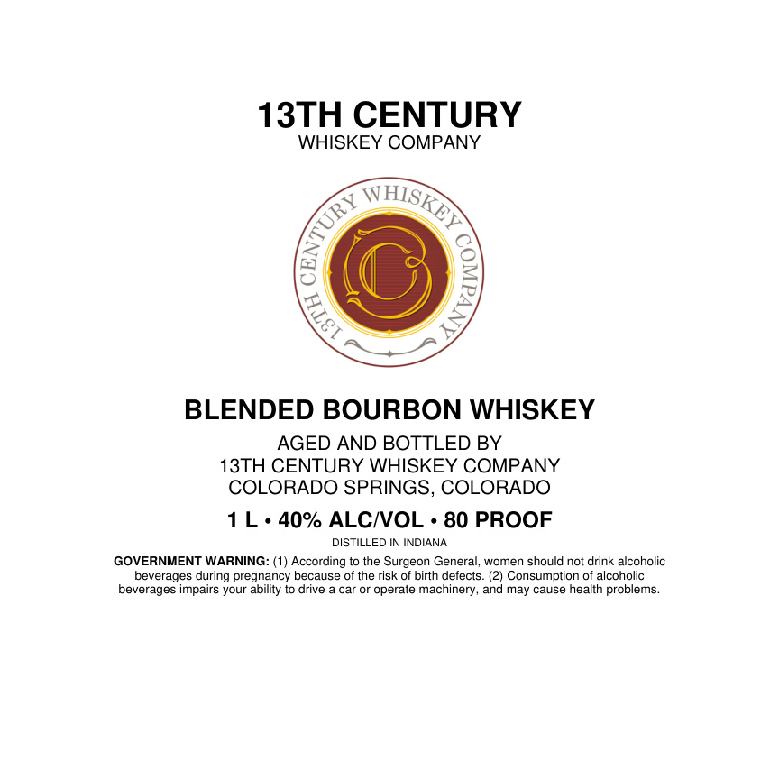

# TTB COLA Label Images - TTBID 26090001000633

**Brand Name:** 13TH CENTURY WHISKEY COMPANY

**Issue Date:** 04/22/2026

**Origin Code:** 13

**Product Class/Type:** 131

**Source:** [TTB Public COLA Registry](https://ttbonline.gov/colasonline/viewColaDetails.do?action=publicFormDisplay&ttbid=26090001000633)

## Label Images

### Back Label

## Extracted Label Text

*Text extracted via OCR - may contain errors*

**Detected Proof:** 80

### Back Label

13TH CENTURY
WHISKEY COMPANY
BLENDED BOURBON WHISKEY
AGED AND BOTTLED BY
13TH CENTURY WHISKEY COMPANY
COLORADO SPRINGS, COLORADO
L
40% ALCIVOL
80 PROOF
DISTILLED IN INDIANA
GOVERNMENT WARNING: (1) According to the Surgeon General, women should not drink alcoholic
beverages during pregnancy because of the risk of birth defects
Consumption of alcoholic
beverages impairs your ability to drive
car or operate machinery , and may cause health problems_
QHISKEY
0
E
