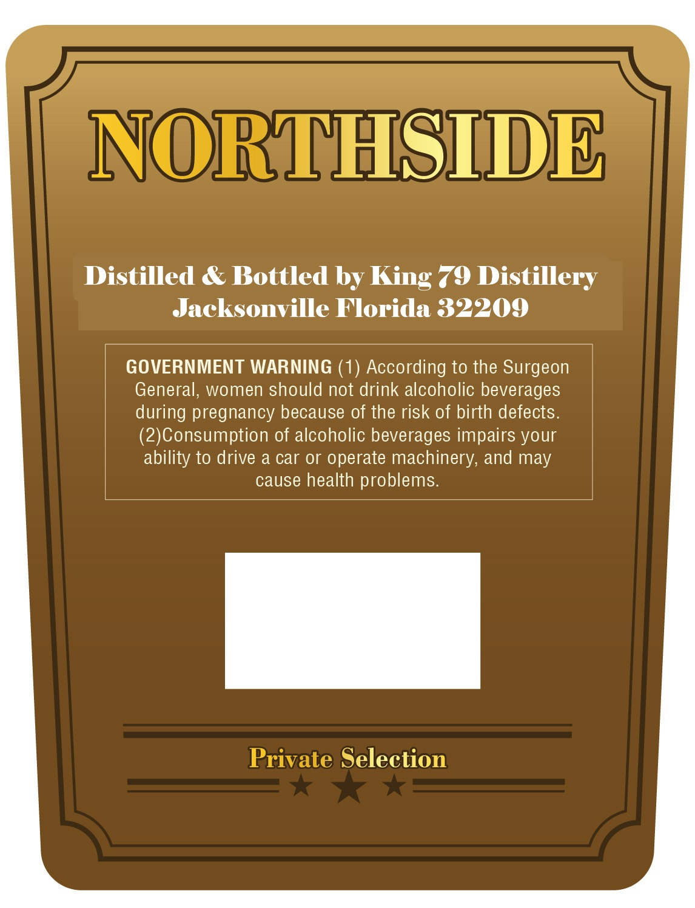
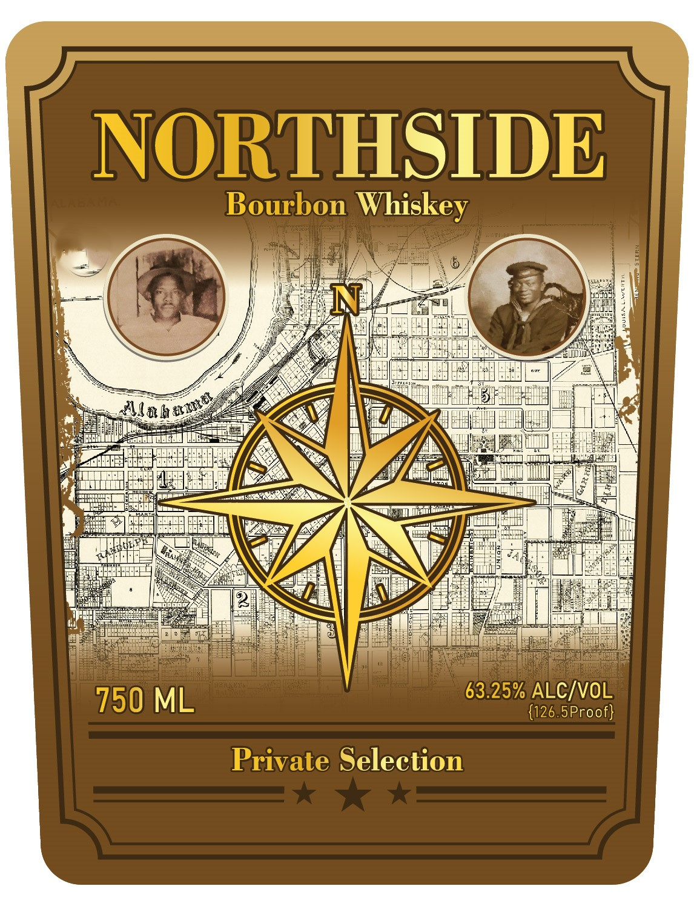

# TTB COLA Label Images - TTBID 26090001000798

**Brand Name:** NORTHSIDE

**Issue Date:** 04/29/2026

**Origin Code:** 16

**Product Class/Type:** 141

**Source:** [TTB Public COLA Registry](https://ttbonline.gov/colasonline/viewColaDetails.do?action=publicFormDisplay&ttbid=26090001000798)

## Label Images

### Back Label

### Front Label

## Extracted Label Text

*Text extracted via OCR - may contain errors*

**Detected Proof:** 126.5

### Back Label

NOMDPEHSIDE

Distilled & Bottled by King 79 Distillery

Jacksonville Florida 32209

GOVERNMENT WARNING (1) According to the Surgeon

General, women should not drink alcoholic beverages

during pregnancy because of the risk of birth defects.

(2)Consumption of alcoholic beverages impairs your

ability to drive a car or operate machinery, and may

cause health problems.

Private Selection

### Front Label

NORTHSIDE
Bourbon
Whiskey
1
1
1
H
63.25% ALCIVOL
750 ML
{126.5Proof}
Private Selection
unta
Ala h
