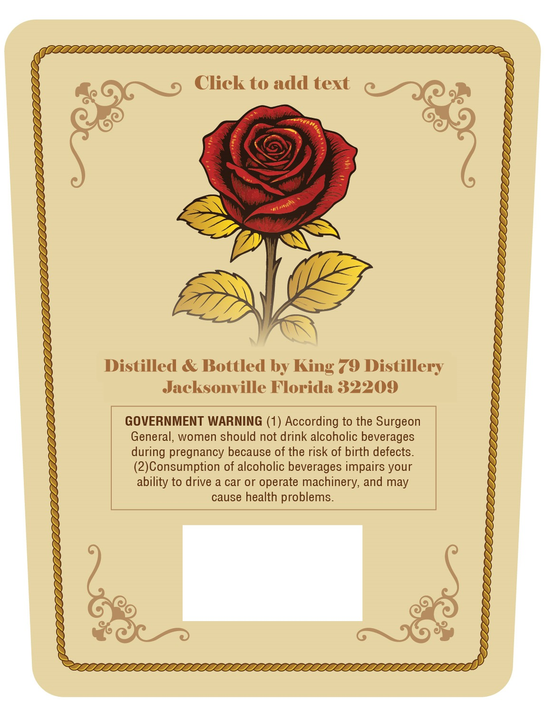
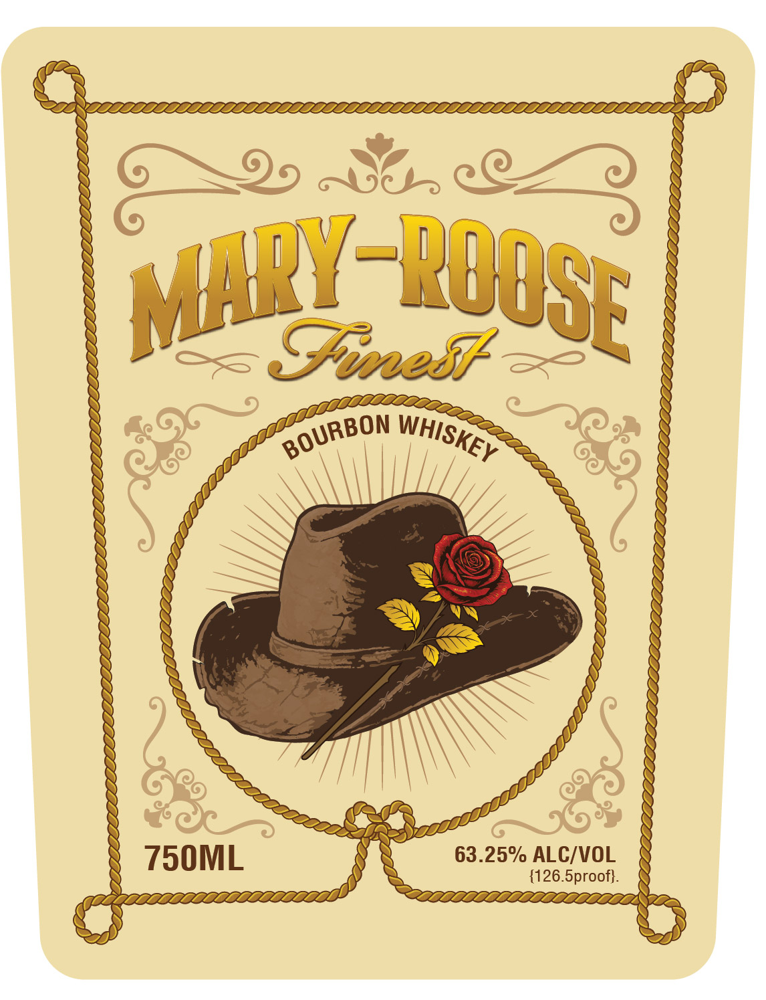

# TTB COLA Label Images - TTBID 26090001000805

**Brand Name:** MARY-ROOSE

**Issue Date:** 04/03/2026

**Origin Code:** 16

**Product Class/Type:** 141

**Source:** [TTB Public COLA Registry](https://ttbonline.gov/colasonline/viewColaDetails.do?action=publicFormDisplay&ttbid=26090001000805)

## Label Images

### Back Label

### Front Label

## Extracted Label Text

*Text extracted via OCR - may contain errors*

*1 image(s) excluded: text did not meet readability threshold*

### Back Label

Click to add text

Distilled & Bottled by King 79 Distillery
Jacksonville Florida 32209

GOVERNMENT WARNING (1) According to the Surgeon
General, women should not drink alcoholic beverages
during pregnancy because of the risk of birth defects.
(2)Consumption of alcoholic beverages impairs your

ability to drive a car or operate machinery, and may
cause health problems.
