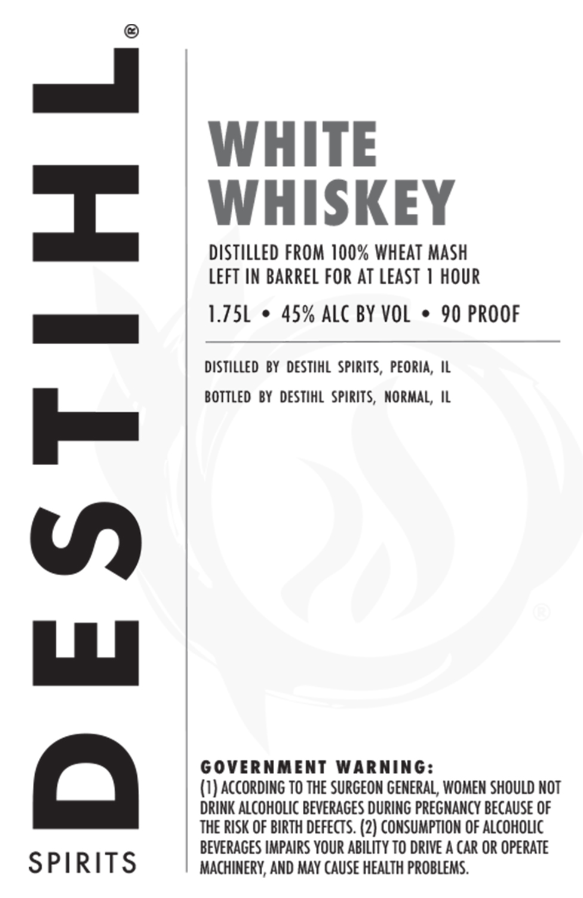

# TTB COLA Label Images - TTBID 26090001000940

**Brand Name:** DESTIHL SPIRITS WHITE WHISKEY

**Issue Date:** 04/02/2026

**Origin Code:** 04

**Product Class/Type:** 140

**Source:** [TTB Public COLA Registry](https://ttbonline.gov/colasonline/viewColaDetails.do?action=publicFormDisplay&ttbid=26090001000940)

## Label Images

### Label 1

## Extracted Label Text

*Text extracted via OCR - may contain errors*

**Detected Proof:** 90

### Label 1

WHITE
WHISKEY
distilled FROM 100% WHEAT Mash
LEFT IN BARREL FOR AT LEAST 1 HOUR
1.J5L
45% ALc BY VOL
90 PROOF
distilled by DESTIHL spirits, Peoria , IL
bottled By  DESTIHL spirits, NormaL; IL
1
GOVERNMENT
WARNING:
(I) according to THE SURGEON GENERAL, WOMEN SHOULD NOT
DRINK AlcohOLIC BEVERAGES DURING PREGMANCY BECAUSE OF
THE RISK OF BIRTH defects. (2) CONSUMPTION OF ALcohoLIc
BEVERAGES IMPAIRS YoUR ABILITY TO DRIVE A CaR OR OpeRATe
SPIRITS
MACHINERY, AND MAY CAUSe HEALTH PRoBLEMS:
