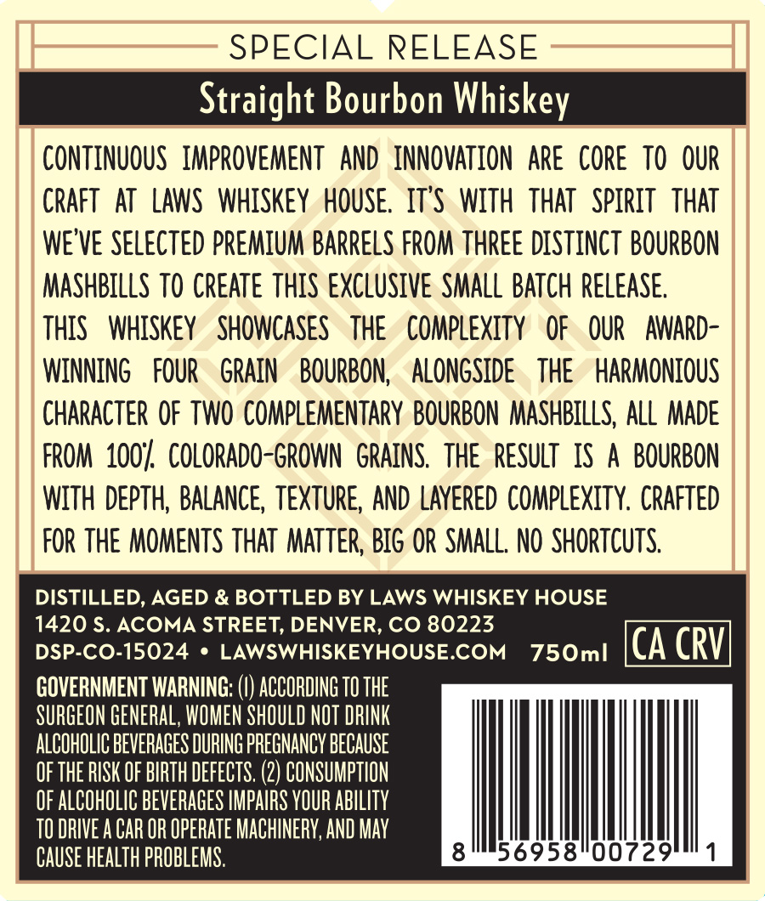
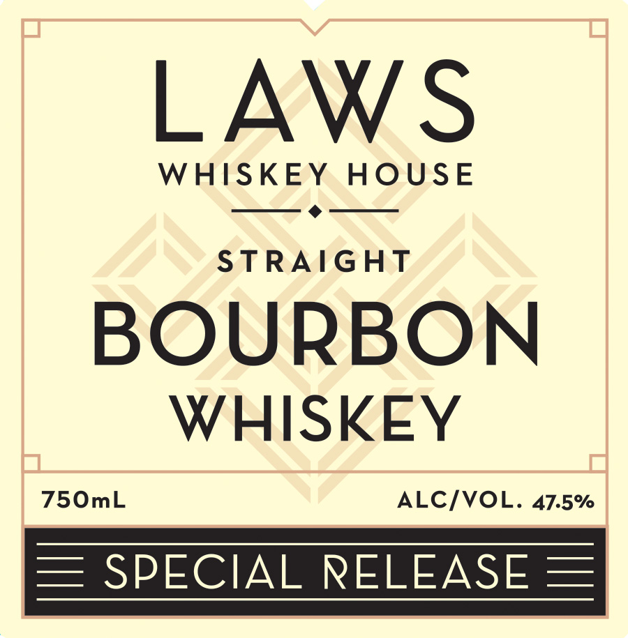

# TTB COLA Label Images - TTBID 26090001000944

**Brand Name:** LAWS WHISKEY HOUSE

**Fanciful Name:** SPECIAL RELEASE

**Issue Date:** 04/08/2026

**Origin Code:** 13

**Product Class/Type:** 141

**Source:** [TTB Public COLA Registry](https://ttbonline.gov/colasonline/viewColaDetails.do?action=publicFormDisplay&ttbid=26090001000944)

## Label Images

### Back Label

### Front Label

## Extracted Label Text

*Text extracted via OCR - may contain errors*

**Detected Proof:** 95

### Back Label

SPECIAL RELEASE
Straight Bourbon Whiskey
conTiNuOUS   IMPROVEMENT   AND   INNOVATION are Core  TO OuR
CRAFT
AT   LAWS   WhISKeY  HOUSE   IT'S  WiTh  ThAT   SpiriT   ThAt
WE'VE SELECTED PREMium Barrels FROM thREE DISTiNcT BOURBON
MashBiLLS TO Create thIS eXCLuSivE SMALL  BATCh RElEASE;
tHiS
WHiSKEY
SHOWCASES
THE
compLeXITy
OF
OUR
AWARD-
WINNING
FOUR
GRAIN
BOURBON;
ALONGSIDE
THE
HARMONIOUS
CHARACTER OF  TWO CompLeMENTARY  BOURBON  MASHBILLS, All MADE
FROM  1004   COLORADO-GROWN   GRAINS   thE   reSult   IS
A BOURBON
WITH  Depth, BALANCE, TEXTURE,AND LAyerEd complexity, CRAFted
FoR the MOMENTS THAT  MATteR; Big OR SMALL, NO ShORTCUTS,
DISTILLED, AGED & BOTTLED BY LAWS WHISKEY HOUSE
1420 $. ACOMA STREET, DENVER, CO 80223
DSP-CO-15024
LAWSWHISKEYHOUSE.COM
750ml
CA CRV
GOVERNMENT WARNING:
ACCORDING TO THE
SURGEON GENERAL, WOMEN SHOULD NOT DRINK
ALCOHOLIC BEVERACES DURING PREGNANCY BECAUSE
OF THE RISK OF BIRTH DEFECTS: (2) CONSUMPTION^
OF ALCOHOLIC BEVERAGES IMPAIRS YOUR AbILITY
TO DRIVE A CAR OR OPERATE MACHINERY; AND May
CAUSe heaLTh PROBLEMS.
8
56958"00729

### Front Label

LAWS
WHISKEY
HOUsE
STRAIGHT
BOURBON
WHISKEY
75OmL
ALC/VOL. 47.5%
SPECIAL RELEASE
