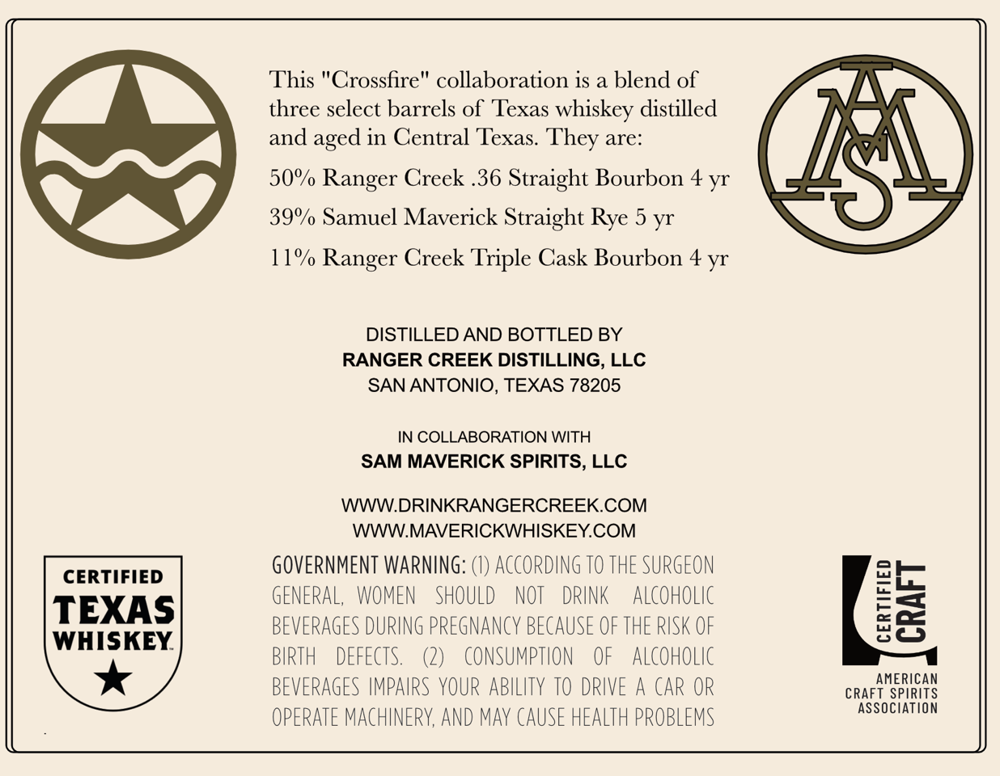
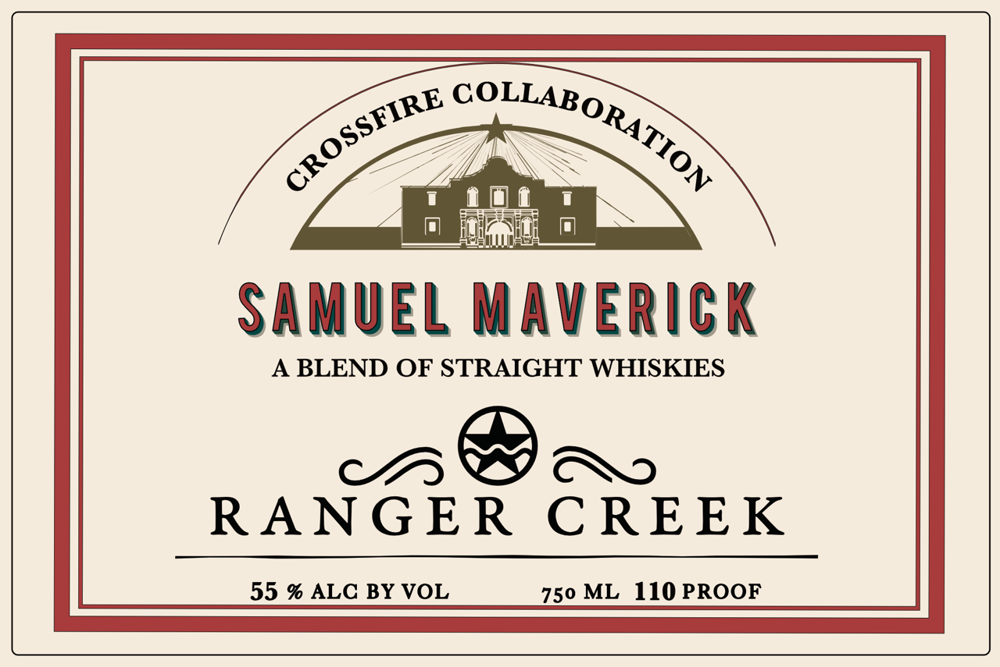

# TTB COLA Label Images - TTBID 26091001000078

**Brand Name:** CROSSFIRE COLLABORATION

**Issue Date:** 04/01/2026

**Origin Code:** 44

**Product Class/Type:** 120

**Source:** [TTB Public COLA Registry](https://ttbonline.gov/colasonline/viewColaDetails.do?action=publicFormDisplay&ttbid=26091001000078)

## Label Images

### Back Label

### Front Label

## Extracted Label Text

*Text extracted via OCR - may contain errors*

**Detected Proof:** 110
**Detected Age:** 5 Years

### Back Label

This "Crossfire" collaboration is a blend of
three select barrels of Texas whiskey distilled
and
in Central Texas:
are:
50% Ranger Creek .36 Straight Bourbon
39%/ Samuel Maverick Straight Rye 5 yr
11%/ Ranger Creek Triple Cask Bourbon 4 yr
DISTILLED AND BOTTLED BY
RANGER CREEK DISTILLING, LLC
SAN ANTONIO, TEXAS 78205
IN COLLABORATION WITH
SAM MAVERICK SPIRITS, LLC
WWWDRINKRANGERCREEK.COM
WWWMAVERICKWHISKEY.COM
CERTIFIED
GOVERNMENT WARNING: (€) ACCORDING TO THE SURGEON
TEXAS
GENERAL,
WOMEN
SHOULD
NOT
DRINK
AlCoHolic
8i
BEVERAGES DURING PRegNancY BECAUSE OF THE RUSK OF
WHISKEY
BIRTH
DEFECTS.
(2)
conSumption
OF
ALCOHOLIC
AMERICAN
BEVERAGES IMPAIRS YOUR ABILITY TO DRIVE A CAR OR
CRAFT SPIRITS
Association
OPERATE MACHINERY, AND may CAUSE HEALTH PROBLEMS
aged
They
4 yr

### Front Label

SAmUEL Maverick
A BLEND OF STRAIGHT WHISKIES
RANG ER
C REEK
55 % ALC BY VOL
750 ML 110 PROOF
COLLABORATION
CROSSFIRE
