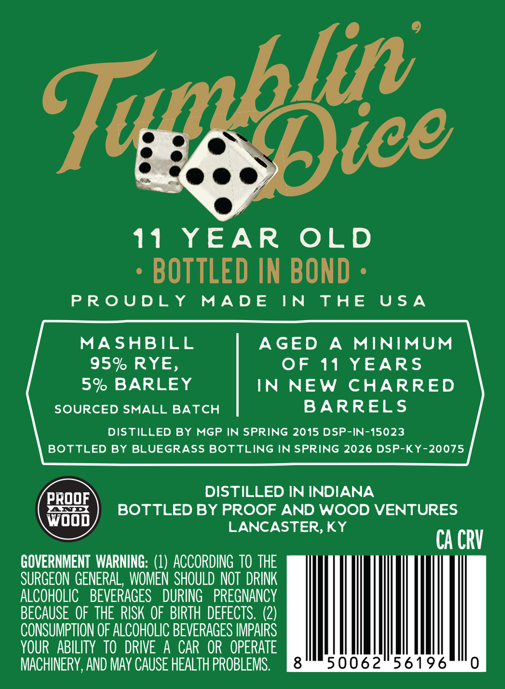
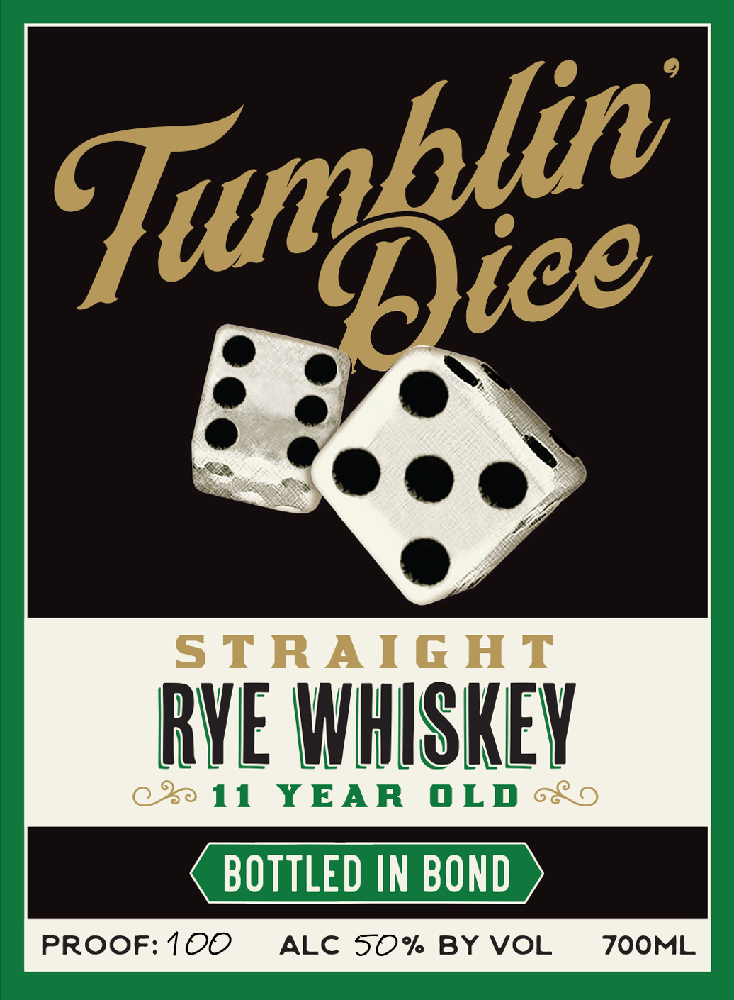

# TTB COLA Label Images - TTBID 26091001000140

**Brand Name:** TUMBLIN DICE

**Issue Date:** 04/01/2026

**Origin Code:** 22

**Product Class/Type:** 102

**Source:** [TTB Public COLA Registry](https://ttbonline.gov/colasonline/viewColaDetails.do?action=publicFormDisplay&ttbid=26091001000140)

## Label Images

### Back Label

### Front Label

## Extracted Label Text

*Text extracted via OCR - may contain errors*

**Detected Proof:** 100
**Detected Age:** 11 Years

### Back Label

Tegepice

11 YEAR OLD
* BOTTLED IN BOND -

PROUDLY MADE IN THE USA

MASHBILL AGED A MINIMUM
95% RYE, OF 11 YEARS
5% BARLEY IN NEW CHARRED

SOURCED SMALL BATCH BARRELS

DISTILLED BY MGP IN SPRING 2015 DSP-IN-15023
BOTTLED BY BLUEGRASS BOTTLING IN SPRING 2026 DSP-KY-20075

aay DISTILLED IN INDIANA
xsxex ) BOTTLED BY PROOF AND WOOD VENTURES
wooo LANCASTER, KY

CA CRV
GOVERNMENT WARNING: (1) ACCORDING 10 THE
SURGEON GENERAL, WOMEN SHOULD NOT DRINK
ALCOHOLIC BEVERAGES DURING PREGNANCY
BECAUSE OF THE RISK OF BIRTH DEFECTS. (2)
CONSUMPTION OF ALCOHOLIC BEVERAGES IMPAIRS
YOUR ABILITY TO DRIVE A CAR OR OPERATE
MACHINERY, AND MAY CAUSE HEALTH PROBLEMS. 50062 56196

### Front Label

S TRAIG HT
BYE WHISKEY
11
YEAR
0 LD
BOTTLED IN BOND
PROOF: 100
ALC 50% BY VOL
ZOOML
Tumblie
