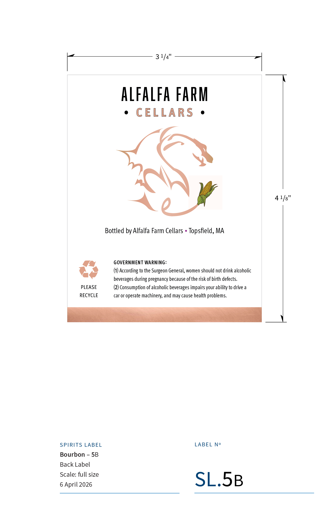

# TTB COLA Label Images - TTBID 26091001000151

**Brand Name:** ALFALFA FARM CELLARS

**Issue Date:** 04/08/2026

**Origin Code:** 26

**Product Class/Type:** 141

**Source:** [TTB Public COLA Registry](https://ttbonline.gov/colasonline/viewColaDetails.do?action=publicFormDisplay&ttbid=26091001000151)

## Label Images

### Back Label

## Extracted Label Text

*Text extracted via OCR - may contain errors*

### Back Label

3 1/4'
alfalfa farM
CELLARS
4 1/8'
Bottled by Alfalfa Farm Cellars
Topsfield, MA
GOVERNMENT WARNING:
According to the Surgeon General, women should not drink alcoholic
beverages during pregnancy because ofthe risk of birth defects.
PLEASE
(2) Consumption of alcoholic beverages impairs your ability to drive a
RECYCLE
car or operate machinery, and may cause health problems
SPIRITS LABEL
LABEL No
Bourbon
SB
Back Label
Scale: full size
6 April 2026
SL.SB
