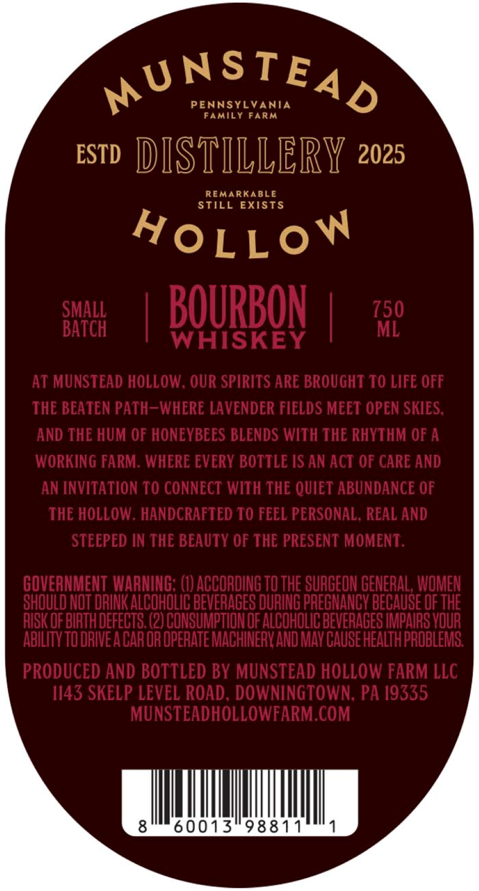
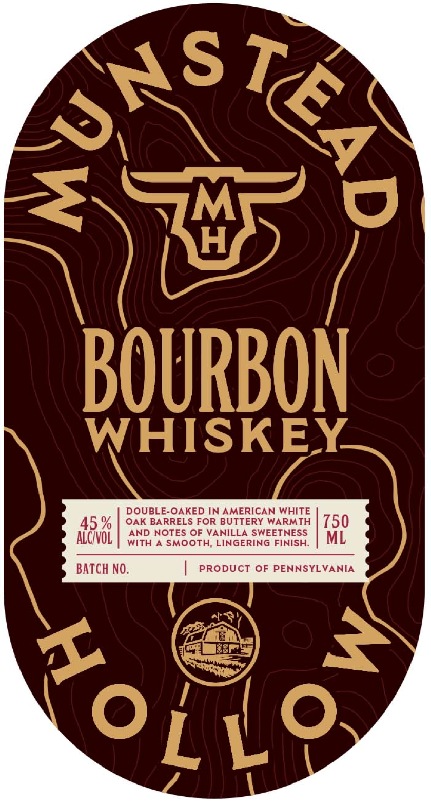
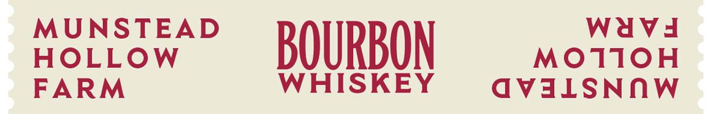

# TTB COLA Label Images - TTBID 26091001000186

**Brand Name:** MUNSTEAD

**Issue Date:** 04/23/2026

**Origin Code:** 39

**Product Class/Type:** 141

**Source:** [TTB Public COLA Registry](https://ttbonline.gov/colasonline/viewColaDetails.do?action=publicFormDisplay&ttbid=26091001000186)

## Label Images

### Back Label

### Front Label

### Label 2

## Extracted Label Text

*Text extracted via OCR - may contain errors*

**Detected Proof:** 90

### Back Label

MUNSTEAD
PENNSYLVANIA
Family FaRM
ESTD
DISTILLERY 2025
REMARKABLE
STILL
EXISTS
HoLLoW
SMALL
BOURBON
750
BATCH
ML
WHISKEY
At MUNSTEAD HOLLOW , OUR SPIRITS ARE BROUGHT TO LIFE OFF
THE BEATEN PATH_WHERE LAVENDER FIELDS MEET OPEN SKIES,
and THE HUM OF HONEYBEES BLENDS WITH THE RHYTHM OF A
WORKING FARM: WHERE EVERY BOTTLE IS AN ACT OF CARE AND
AN INVITATION TO CONNECT WITH THE QUIET ABUNDANCE OF
THE HOLLOW . HANDCRAFTED TO FEEL PERSONAL; REAL AND
STEEPED IN THE BEAUTY OF THE PRESENT MOMENT:
GOVEANMENT WARNING; (I) ACCORDING TO THE SURGEON GENERAL, WOMEN
SHOuLD NOT DRINK ALCOHOLIC BEVERAGES DURING PREGNANCV BECAUSE OF THE
RISK OF BIRTH DEFECTS; (2) CONSUMPTIONOF ALCOHOLIC BEVERAGES IMPAIRS VOUR
ABILITY TODRIVE A CAROR OPERATE MACHINERV AND MAv CAUSE HEALTH PROBLEMS
PRODUCED AND BOTTLED BY MUNSTEAD HOLLOW FARM LLC
1143 SKELP LEVEL ROAD , DOWNINGTOWN; PA /9335
MUNSTEADHOLLOWFARM COM
8
60013
98811

### Front Label

BOURBON
WHISKEY
DOUBLE-OAKED IN AMERICAN WHITE
45 %
OAK BARRELS FOR BUTTERY WARMTH
750
AND NOTES OF VANILLA SWEETNESS
AlchvoL
WITH A SMOOTH; LINGERING FINISH:
ML
BATCH NO:
PRODUCT OF PENNSYLVANIA
AuNS
6
ko[io

### Label 2

MUNSTEAD

HOLLOW

BOURBON

MOTIOH

Wwavd

HISKEY

davalLSNnw
